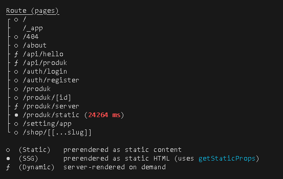
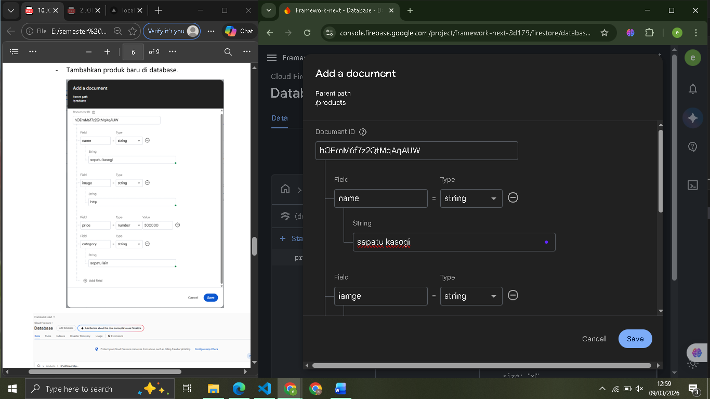
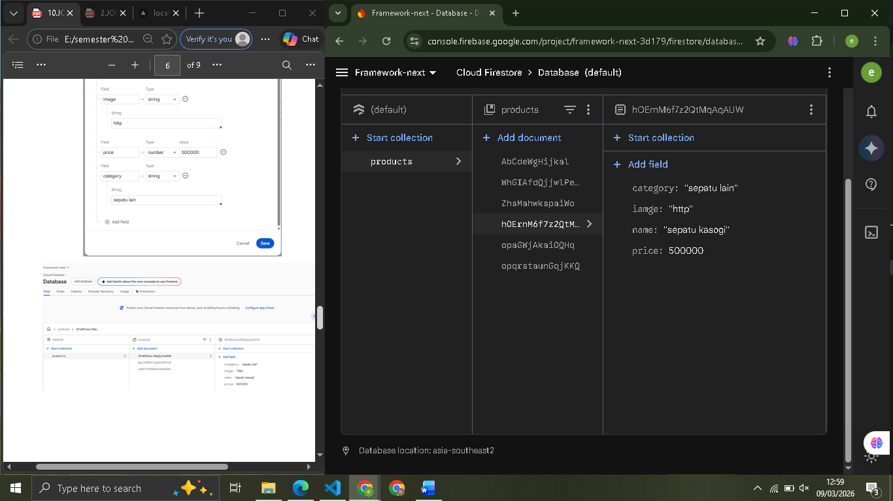
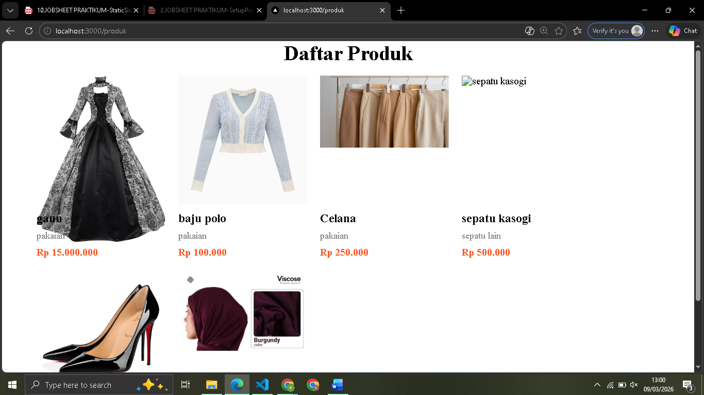
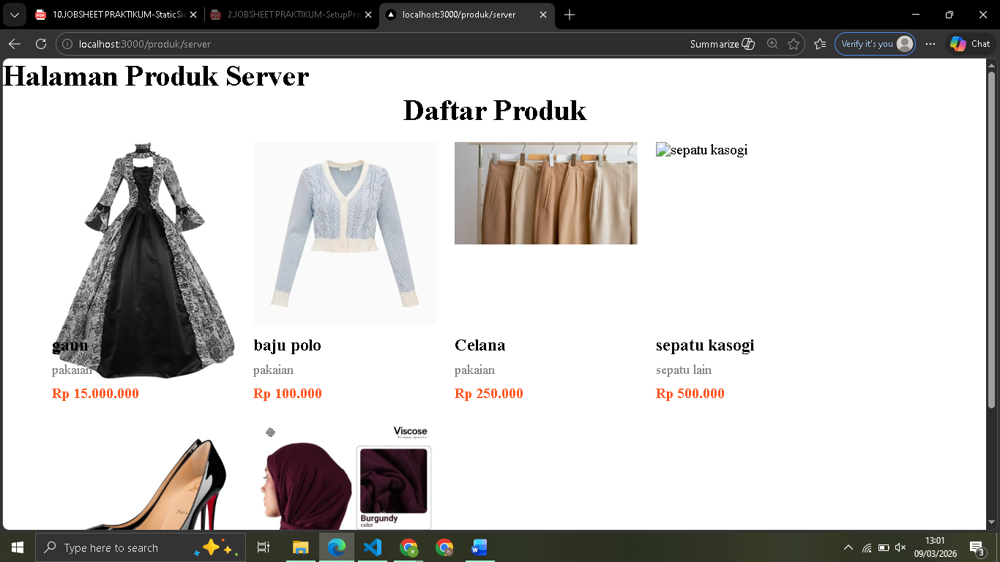
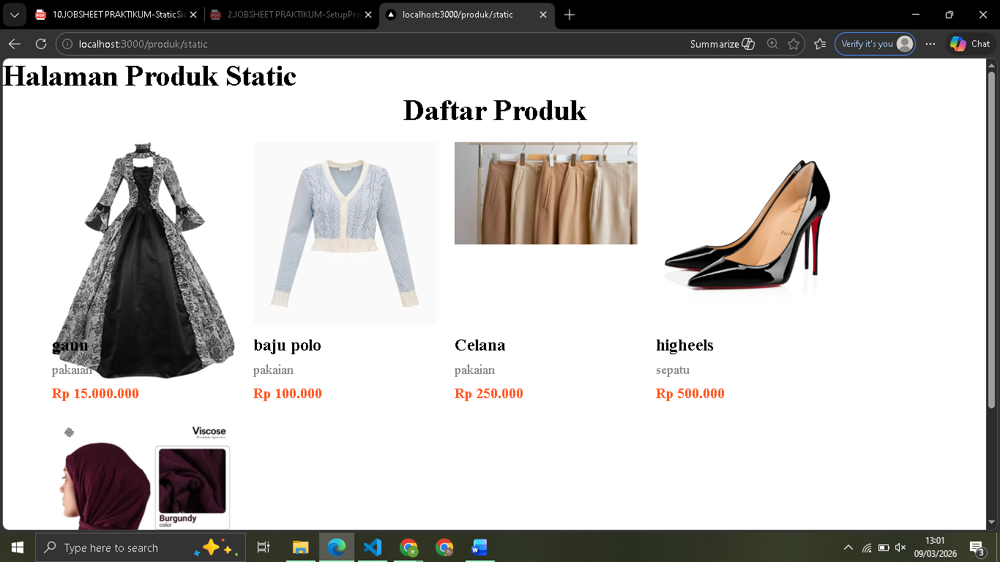
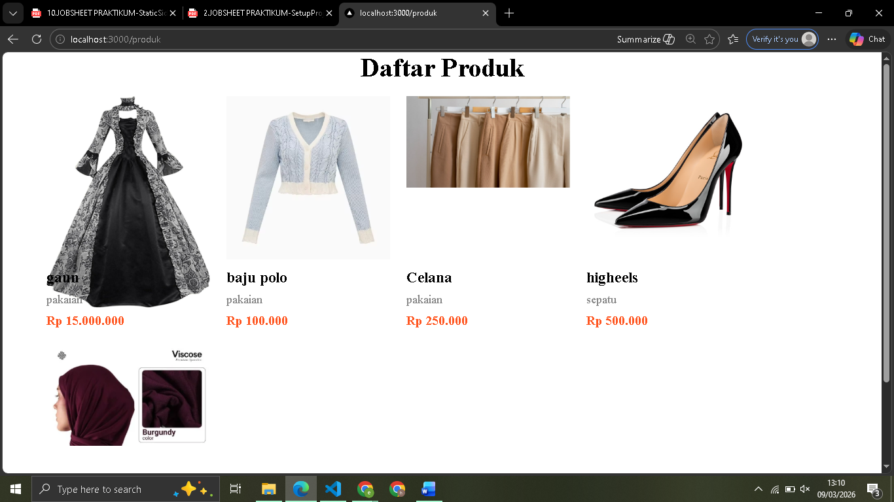
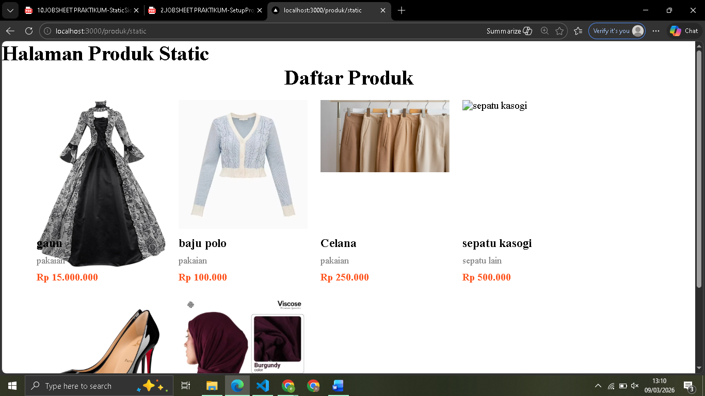

 
 LAPORAN PRAKTIKUM PEMROGRAMAN BERBASIS FRAMEWORK 

# 
 JOBSHEET 10 

    

    

     

 Nama       : ESA PRATAMA PUTRI 

 NIM        : 2341720061 

 Kelas      : TI-3D  

 Jurusan    : TEKNOLOGI INFORMASI 

## Bagian 1 – Setup Halaman Static

## Bagian 3 – Build Production Mode

  
  

## Bagian 4 – Pengujian Perubahan Data

1. Uji 1 – Tambah Data di Database
     
     
2. Uji 2 – Build Ulang
     
     
     
     

## D. Tugas Praktikum

1. Buat 3 halaman:
   o CSR
   o SSR
   o SSG
     
     
     

2. Lakukan pengujian:
   o Tambah data
   o Hapus data
   o Bandingkan hasil
     
     
     
     

3. Buat laporan analisis minimal 3 halaman.  
   A. Pengujian pada Client-Side Rendering (CSR)
   - Proses Tambah Data: Ketika data baru ditambahkan melalui form, aplikasi akan mengirimkan permintaan POST ke API. Karena useSWR atau fetcher memantau perubahan secara real-time, daftar produk akan langsung diperbarui di browser tanpa perlu membangun ulang aplikasi.  
   - Proses Hapus Data: Saat data dihapus, halaman akan melakukan re-validation dan menghapus elemen produk dari tampilan secara instan. 

B. Pengujian pada Server-Side Rendering (SSR)  

- Proses Tambah Data: setelah data ditambahkan ke database, pengguna hanya perlu melakukan refresh pada halaman /produk/server. Fungsi getServerSideProps akan dijalankan ulang oleh server, mengambil data terbaru, dan mengirimkan HTML yang sudah diperbarui.
- Proses Hapus Data: Sama dengan tambah data, penghapusan data akan langsung berakibat pada hilangnya konten tersebut dari HTML yang dikirimkan server pada permintaan berikutnya.

C. Pengujian pada Static Site Generation (SSG) 

- Proses Tambah Data: Jika data sudah berhasil ditambahkan ke database/API, halaman /produk/static tetap akan menampilkan data lama. Hal ini terjadi karena HTML sudah "tersimpan" menjadi file statis saat proses npm run build dilakukan.
- Proses Hapus Data: Konten yang sudah dihapus secara permanen di database akan tetap muncul di browser jika menggunakan (npm run start). Link gambar mungkin akan pecah atau data tidak bisa diakses lebih lanjut, namun teks produk masih tertulis di halaman statis tersebut.

## E. Studi Analisis

1. Mengapa SSG tidak menampilkan data terbaru?  

- SSG (Static Site Generation) mengambil data dari API atau database hanya pada saat proses build dilakukan (npm run build). Hasilnya berupa file HTML statis. Jadi, jika ada penambahan atau penghapusan produk setelah proses build selesai, file HTML tersebut tidak akan berubah karena tidak melakukan permintaan data ulang ke server saat diakses.

2. Mengapa SSG lebih cepat?  

- SSG lebih cepat karena server tidak perlu melakukan komputasi. Server hanya perlu mengirimkan file HTML yang sudah jadi.

3. Kapan SSG tidak cocok digunakan?  

- SSG tidak cocok digunakan pada halaman yang datanya sangat dinamis atau sering berubah dalam hitungan detik/menit.

4. Mengapa e-commerce tidak cocok menggunakan SSG murni?  

- E-commerce membutuhkan data yang akurat secara real-time, seperti jumlah stok barang dan perubahan harga. Jika menggunakan SSG, pelanggan mungkin melihat barang masih tersedia padahal sudah habis (karena belum build ulang). Hal ini akan menyebabkan pengalaman pengguna yang buruk dan kesalahan transaksi karena ketidaksinkronan data antara tampilan dan stok asli di database.

5. Apa perbedaan build mode dan development mode? 

- Development Mode (npm run dev): Digunakan saat proses koding. Fitur seperti Hot Module Replacement aktif sehingga perubahan kode langsung terlihat, dan fungsi seperti getStaticProps akan dijalankan pada setiap request untuk mempermudah pengecekan data.
- Build Mode (npm run build & npm run start): Digunakan untuk versi produksi. Next.js melakukan pra-render halaman sesuai metode yang dipilih (SSG/SSR) untuk memastikan performa maksimal saat diakses.
