# 
 LAPORAN PRAKTIKUM PEMROGRAMAN BERBASIS FRAMEWORK 

# 
 JOBSHEET 11 

    

    

     

 Nama       : ESA PRATAMA PUTRI 

 NIM        : 2341720061 

 Kelas      : TI-3D  

 Jurusan    : TEKNOLOGI INFORMASI 

## Bagian 1 – Membuat Dynamic Route

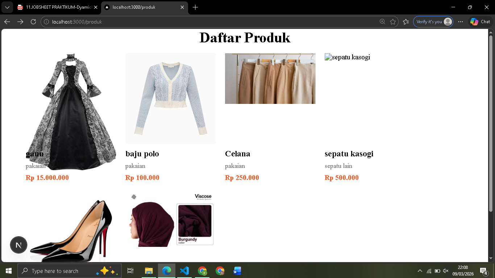  
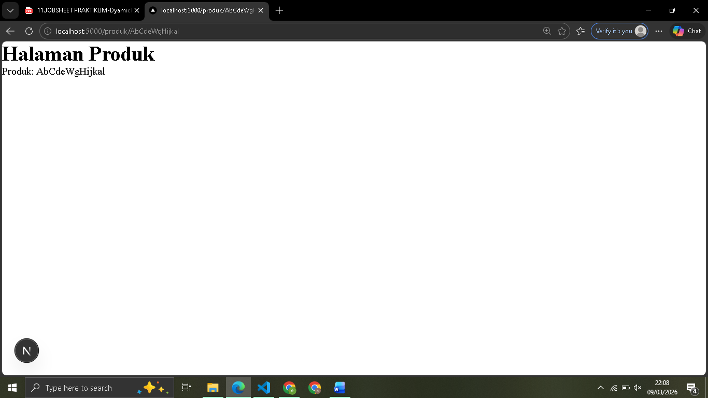  

## Bagian 2 – Implementasi CSR (Client Rendering)

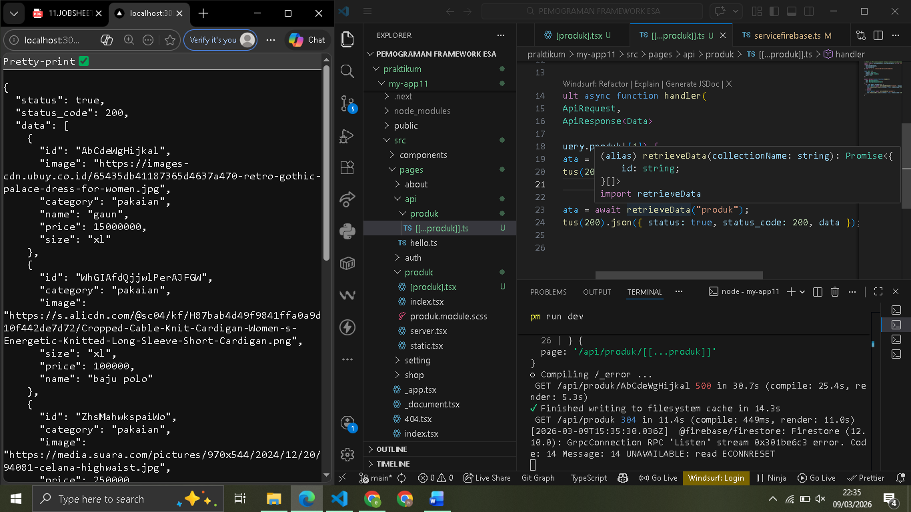  
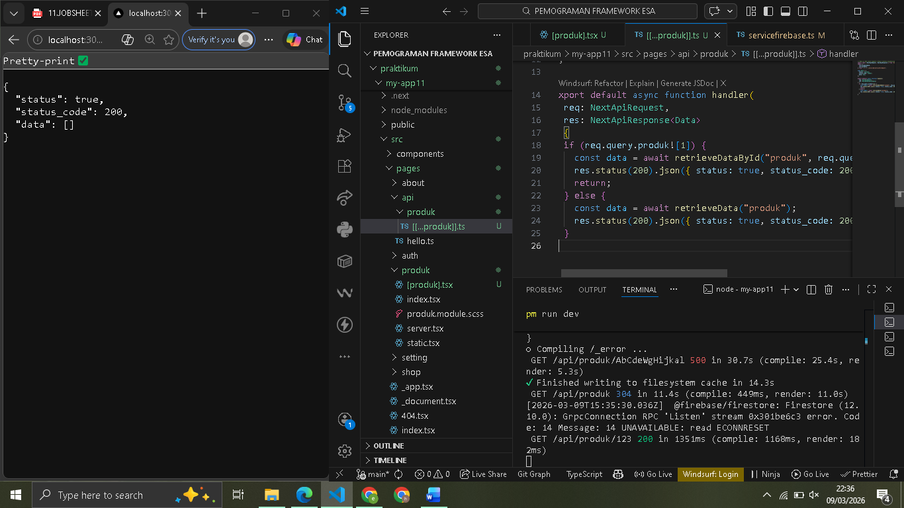  
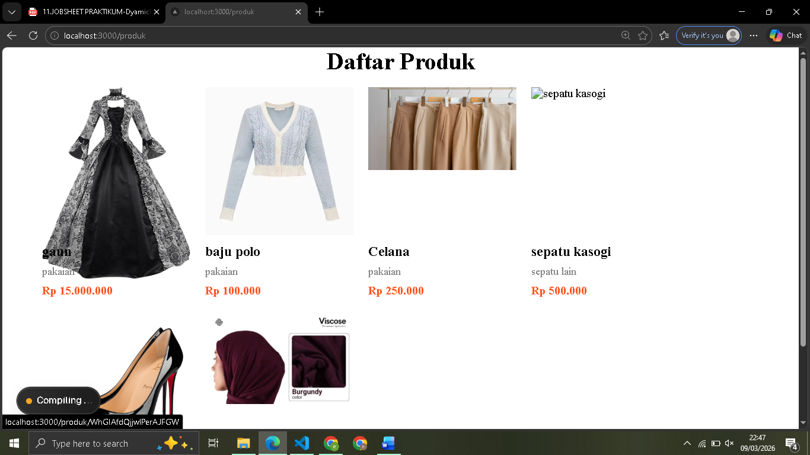  
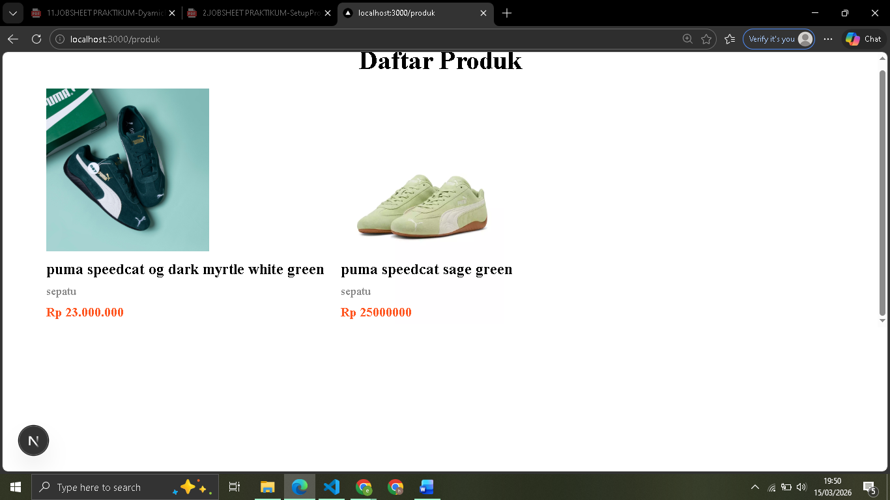  
  
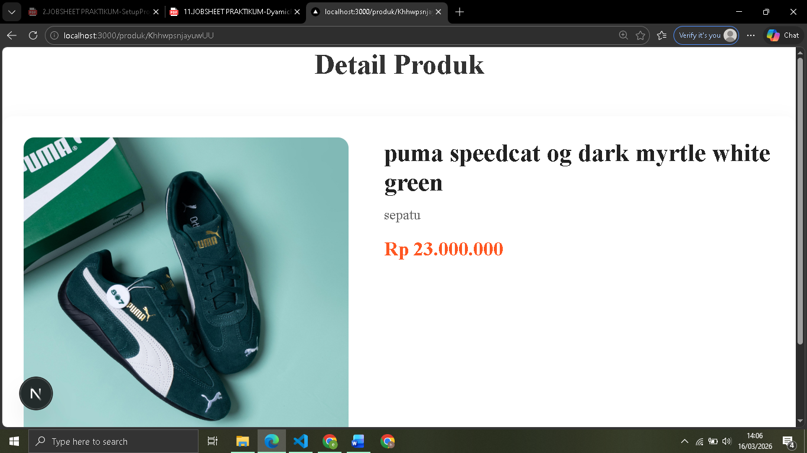  

## Bagian 3 – Implementasi SSR

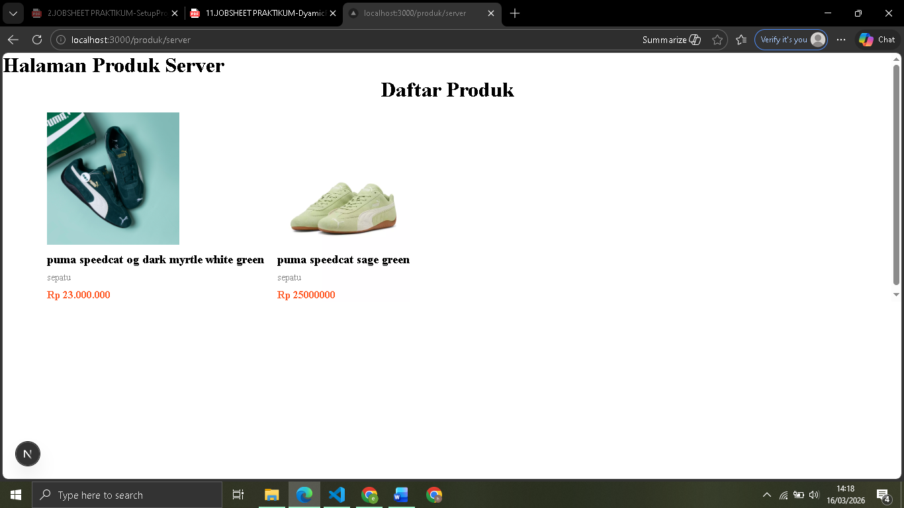  
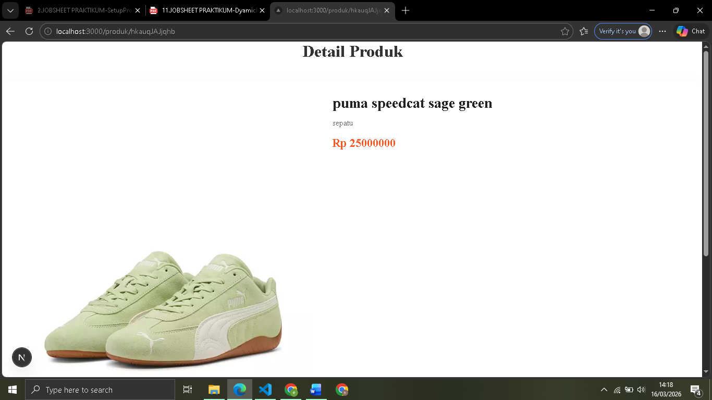  

## Bagian 4 – Implementasi Static Site Generation (Dynamic SSG)

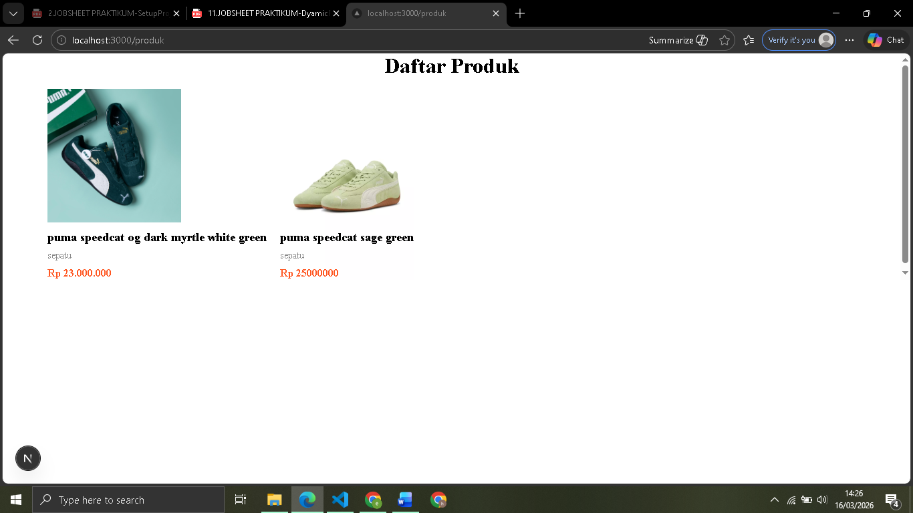  
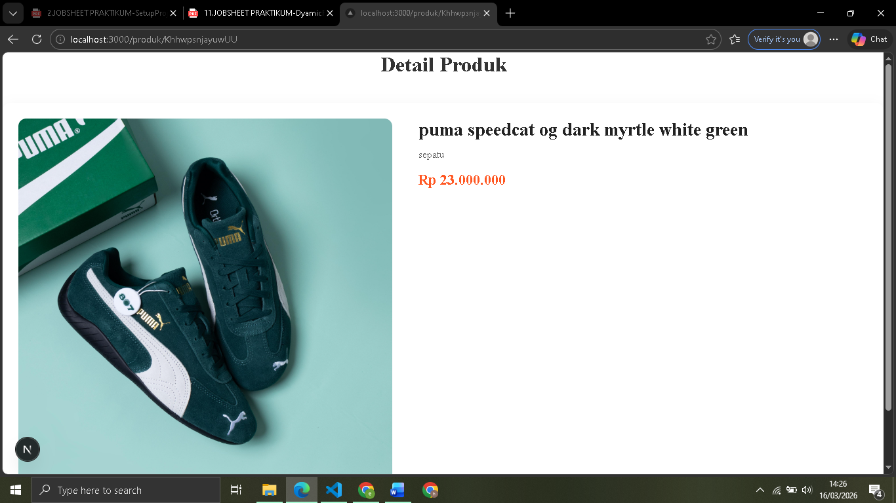  

## E. Tugas Praktikum

1. Loading  

- csr
  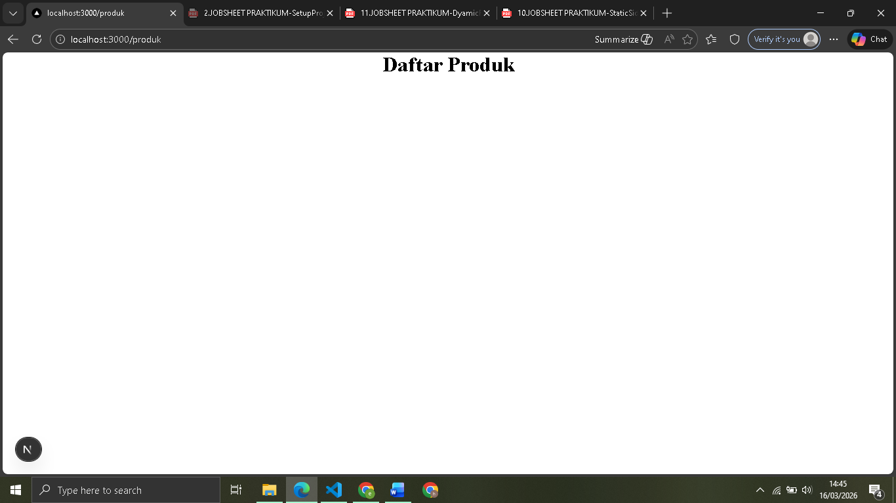  
- ssr
    
- ssg
  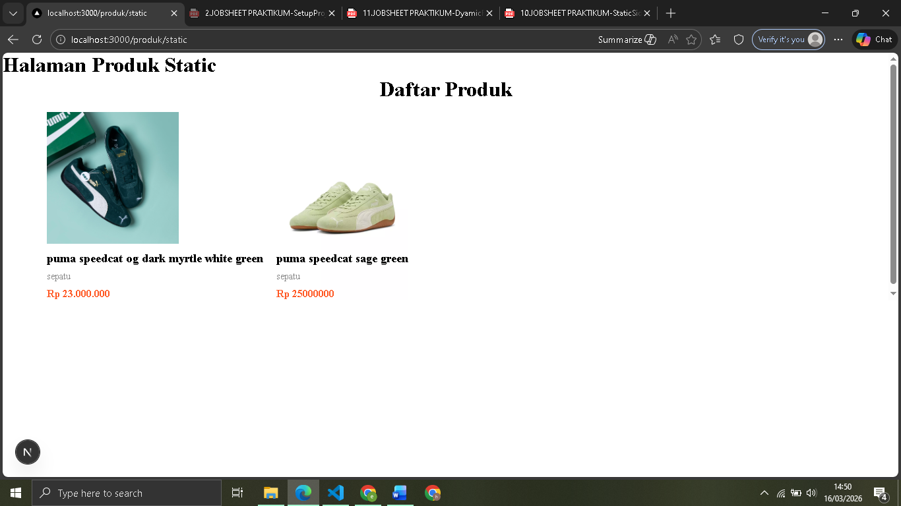  

2. build  
   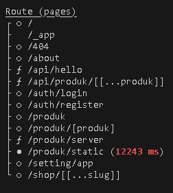  

3. SEO  

- csr
  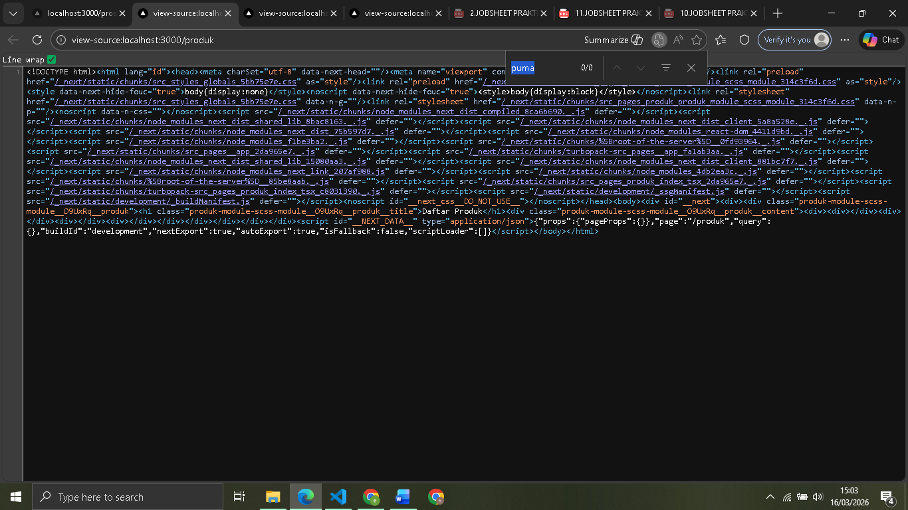  
- ssr
  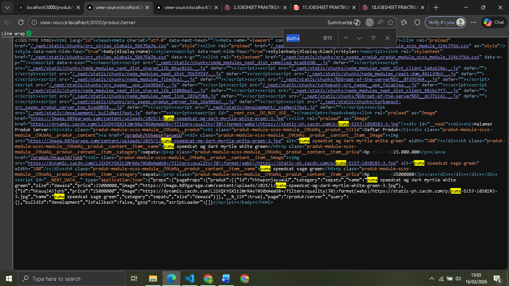  
- ssg
    

4. perubahan Data  

- csr
  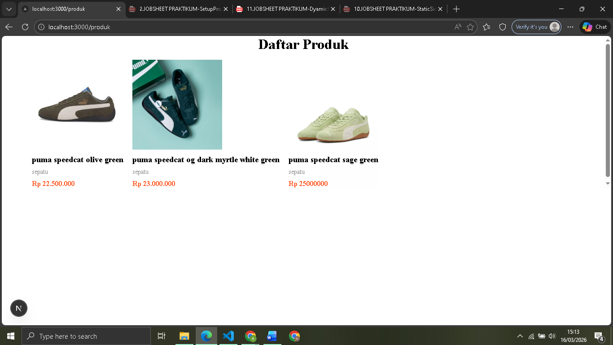  
- ssr
  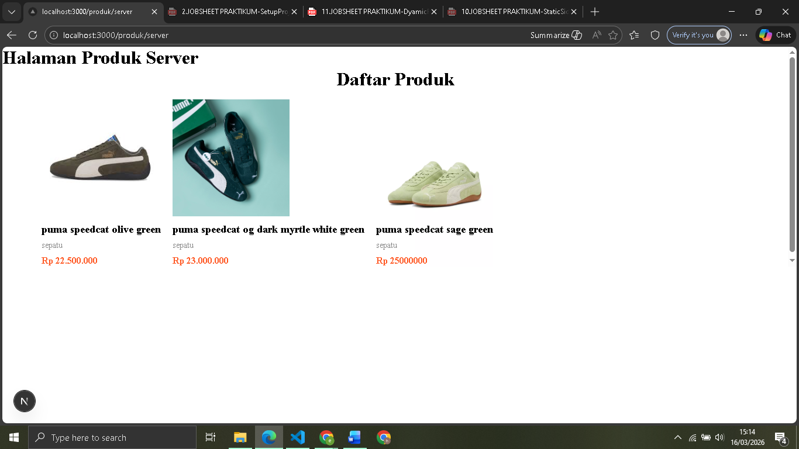  
- ssg
    

## F. Pertanyaan Refleksi

1. Mengapa getStaticPaths wajib pada dynamic SSG?

- Karena pada metode SSG, semua halaman HTML dibuat di awal saat proses build. Untuk rute dinamis (seperti /produk/[id]), Next.js tidak tahu ID apa saja yang ada di database. getStaticPaths bertugas memberi tahu Next.js daftar ID tersebut agar Next.js bisa mencetak semua halaman produknya satu per satu sebelum aplikasi dijalankan.

2. Mengapa CSR membutuhkan loading state?

- Karena pada CSR, browser menerima HTML kosong dari server. Data baru diminta ke API menggunakan JavaScript setelah halaman muncul di layar. Selama proses menunggu data dari API selesai, loading state tahu bahwa aplikasi sedang bekerja dan tidak menganggap halaman tersebut error atau kosong.

3. Mengapa SSG tidak menampilkan produk baru tanpa build ulang?

- Karena SSG bersifat statis. Halaman produk dibuat berdasarkan data yang ada saat perintah build dijalankan. Jika ada data baru di database setelah build selesai, halaman HTML untuk data tersebut belum tercipta. sebabnya harus menjalankan build ulang agar Next.js membuat file HTML baru untuk produk.

4. Mana metode terbaik untuk halaman detail e-commerce?

- SR lebih baik jika stok dan harga berubah sangat cepat (real-time) agar data selalu akurat.
- SSG/ISR lebih baik jika ingin kecepatan akses maksimal dan SEO yang sangat kuat, namun butuh penanganan ekstra agar data tetap diperbarui.

5. Apa risiko menggunakan SSG untuk produk yang sering berubah?

- Data Inconsistency (Data Tidak Akurat). bisa melihat harga lama atau stok yang sebenarnya sudah habis karena halaman yang mereka lihat adalah hasil lama. Untuk mengatasinya, harus sering melakukan build ulang atau menggunakan fitur Revalidation (ISR)
