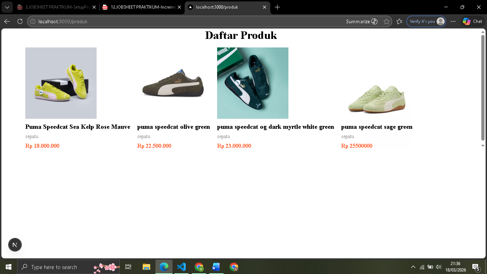
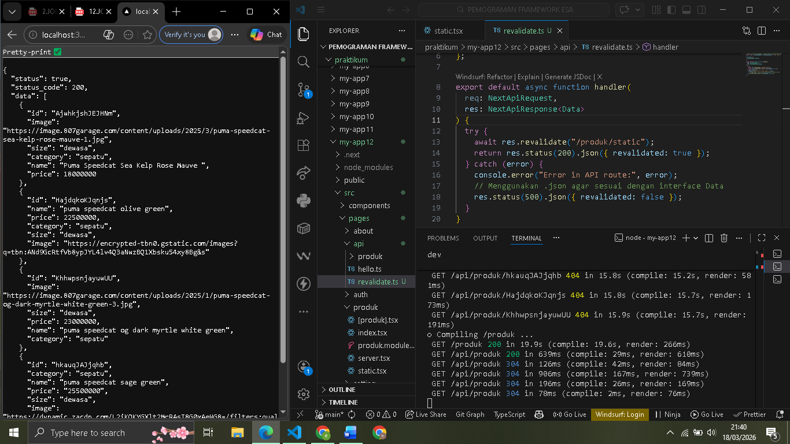
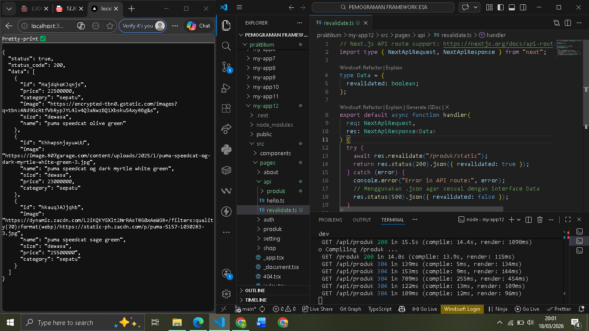
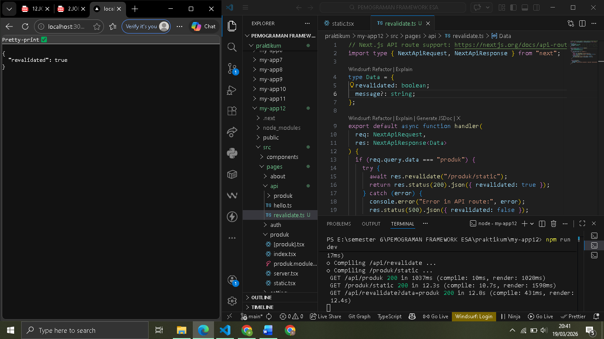
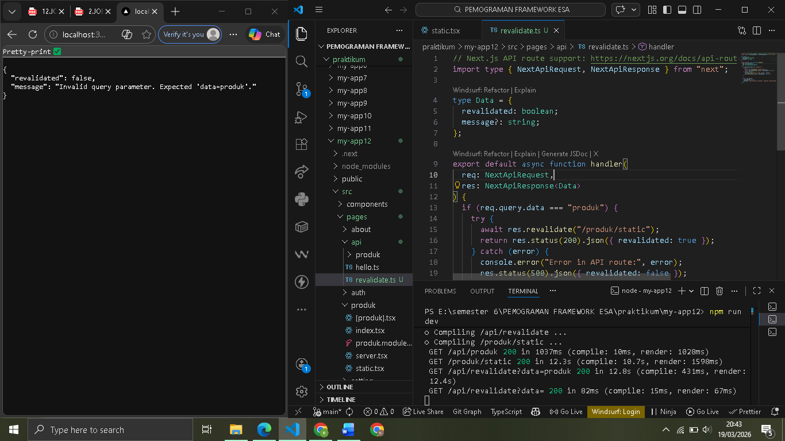
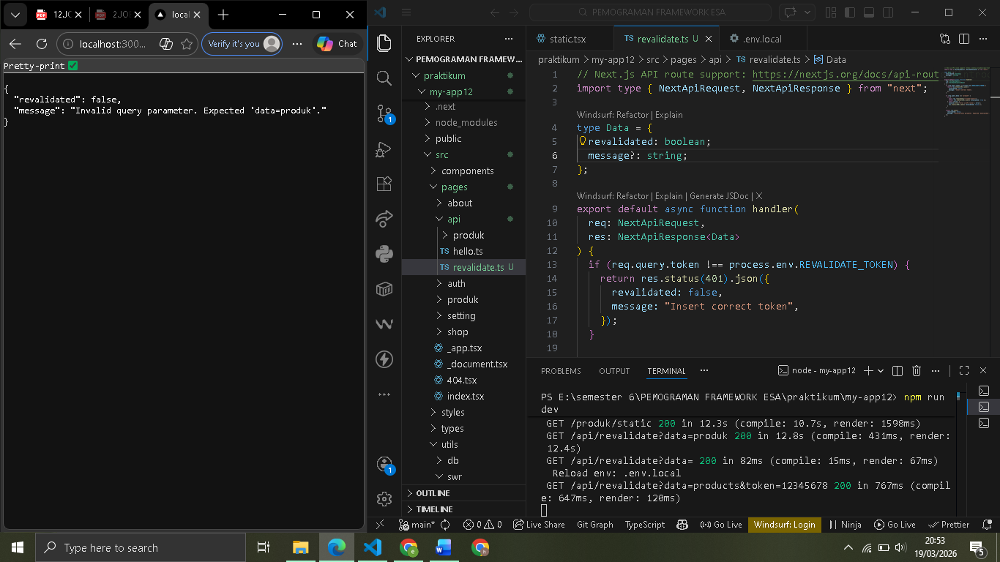

# 
 LAPORAN PRAKTIKUM PEMROGRAMAN BERBASIS FRAMEWORK 

# 
 JOBSHEET 12 

    

    

     

 Nama       : ESA PRATAMA PUTRI 

 NIM        : 2341720061 

 Kelas      : TI-3D  

 Jurusan    : TEKNOLOGI INFORMASI 

## Bagian 1 – Tambahkan revalidate

  

## Bagian 1 – Buat API Revalidate

  
  

## Bagian 2 – Tambahkan Parameter Data

  
  
  

## H. Pertanyaan Analisis

1. Mengapa ISR lebih fleksibel dibanding SSG?

- Karena SSG hanya membuat halaman satu kali saat proses build. Jika ada perubahan data, harus rebuild seluruh aplikasi. Sedangkan ISR (Incremental Static Regeneration) memungkinkan untuk memperbarui halaman statis tertentu di latar belakang tanpa harus melakukan build ulang seluruh aplikasi.

2. Apa perbedaan revalidate waktu dan on-demand?

- Revalidate Waktu (Time-based): Pembaruan terjadi otomatis secara berkala berdasarkan interval detik yang tentukan (misal: revalidate: 10).
- On-Demand: Pembaruan hanya terjadi jika terjadi kejadian tertentu (seperti klik tombol simpan atau pemanggilan API khusus), sehingga lebih efisien karena hanya update saat data benar-benar berubah

3. Mengapa endpoint revalidation harus diamankan?

- Karena endpoint memicu server untuk melakukan proses render ulang halaman. Jika tidak diamankan.

4. Apa risiko jika token tidak digunakan?

- Risikonya adalah serangan DDoS atau penyalahgunaan resource. Tanpa token, pihak luar bisa menjalankan fungsi res.revalidate() secara terus-menerus yang bisa menyebabkan server crash atau kuota baca database (seperti Firebase) membengkak dan cepat habis.

5. Kapan ISR lebih cocok dibanding SSR?

- ISR lebih cocok digunakan untuk halaman yang datanya jarang berubah tapi harus tetap cepat (seperti katalog produk atau blog). ISR memberikan kecepatan akses seperti halaman statis, sedangkan SSR lebih cocok untuk halaman yang datanya sangat dinamis dan berbeda-beda untuk setiap user (seperti halaman keranjang belanja atau dashboard pribadi).
