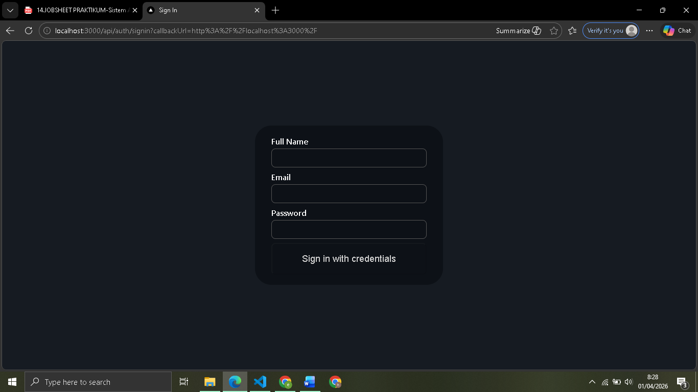
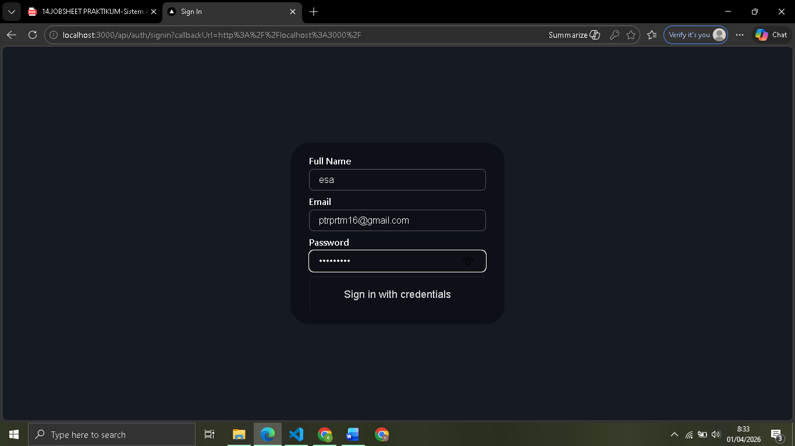
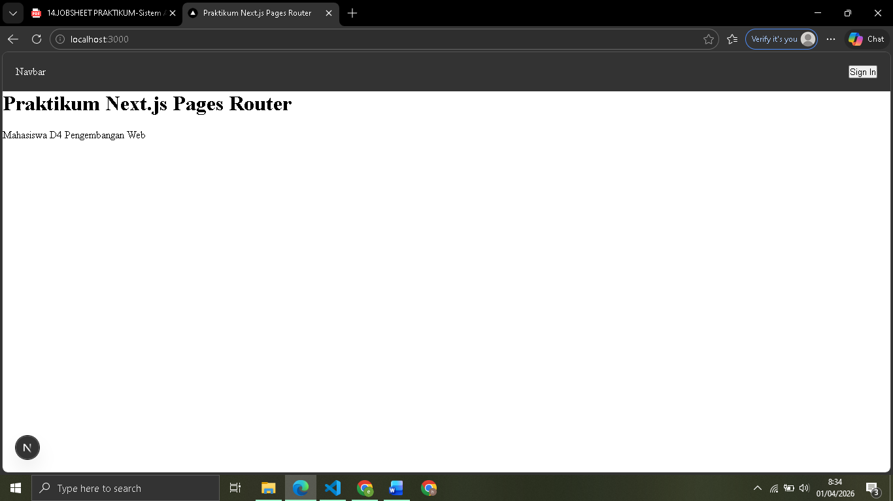
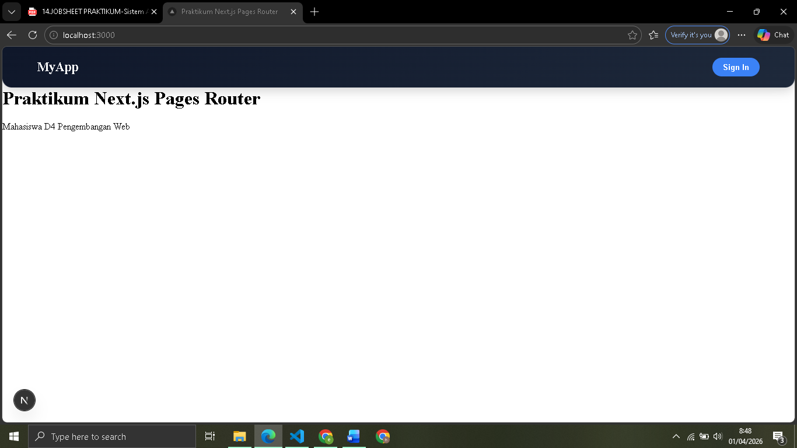
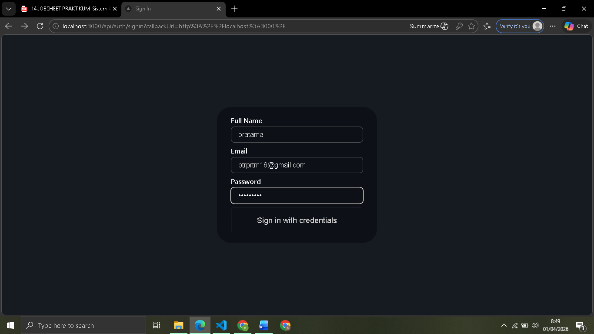
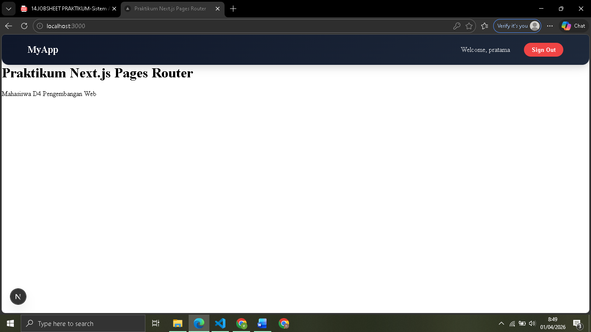

# 
 LAPORAN PRAKTIKUM PEMROGRAMAN BERBASIS FRAMEWORK 

# 
 JOBSHEET 14

    

    

     

 Nama       : ESA PRATAMA PUTRI 

 NIM        : 2341720061 

 Kelas      : TI-3D  

 Jurusan    : TEKNOLOGI INFORMASI 

## Bagian 5 – Tambahkan Tombol Login & Logout

  
  
  
  
  

## D. Menambahkan Data Tambahan (Full Name)

  
  
  

## I. Pertanyaan Analisis

1. Mengapa session menggunakan JWT?

- Session menggunakan JWT (JSON Web Token) karena sifatnya yang stateless. Saat server tidak perlu menyimpan data session di database atau memori (RAM). Semua informasi user terenkripsi di dalam token yang disimpan di browser (cookie). Ini membuat aplikasi lebih cepat, ringan, dan mudah untuk dikembangkan ke skala yang lebih besar (scalable).

2. Apa perbedaan authorize() dan callback jwt()?

- Authorize(): Berfungsi sebagai pintu masuk. Tugasnya memeriksa apakah email dan password yang diinput user benar atau tidak. Jika benar, ia mengembalikan data user.
- Callback jwt(): Berfungsi sebagai pengatur data. Setelah authorize() berhasil, fungsi ini dipanggil untuk menentukan data apa saja (misal: fullname, role) yang ingin dimasukkan ke dalam token terenkripsi agar bisa digunakan di seluruh aplikasi.

3. Mengapa middleware perlu getToken()?

- Middleware menggunakan getToken() untuk validasi akses secara cepat. Sebelum sebuah halaman dirender, middleware mengambil token dari request untuk mengecek apakah user sudah login atau memiliki izin. Jika getToken() menghasilkan null, middleware bisa langsung mengarahkan (redirect) user kembali ke halaman login tanpa harus memuat konten halaman yang dilindungi.

4. Apa risiko jika NEXTAUTH_SECRET tidak digunakan?

- Digunakan sebagai kunci untuk menandatangani (signing) dan mengenkripsi JWT. Tanpa secret yang kuat, orang asing bisa dengan mudah memalsukan isi token, berpura-pura menjadi user lain (admin), dan membajak akun tanpa perlu tahu password aslinya.

5. Apa perbedaan autentikasi dan otorisasi dalam sistem ini?

- Autentikasi (Authentication): Proses pembuktian identitas. Menjawab pertanyaan: "Siapa Anda?" (Contoh: Proses Login dengan Email & Password).
- Otorisasi (Authorization): Proses pengecekan hak akses. Menjawab pertanyaan: "Apa yang boleh Anda lakukan?" (Contoh: Menentukan apakah user biasa boleh mengakses halaman admin atau tidak).
