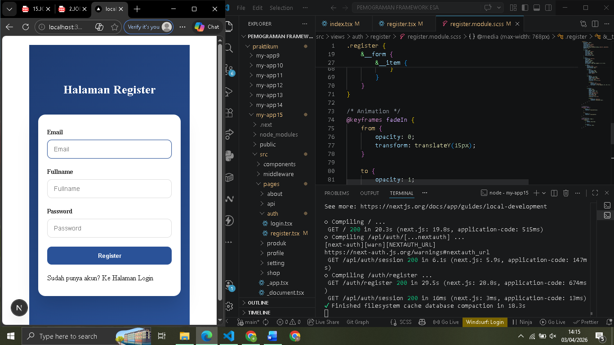
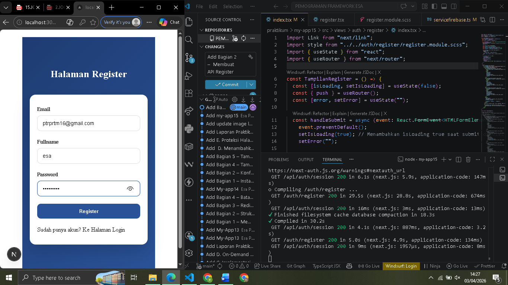
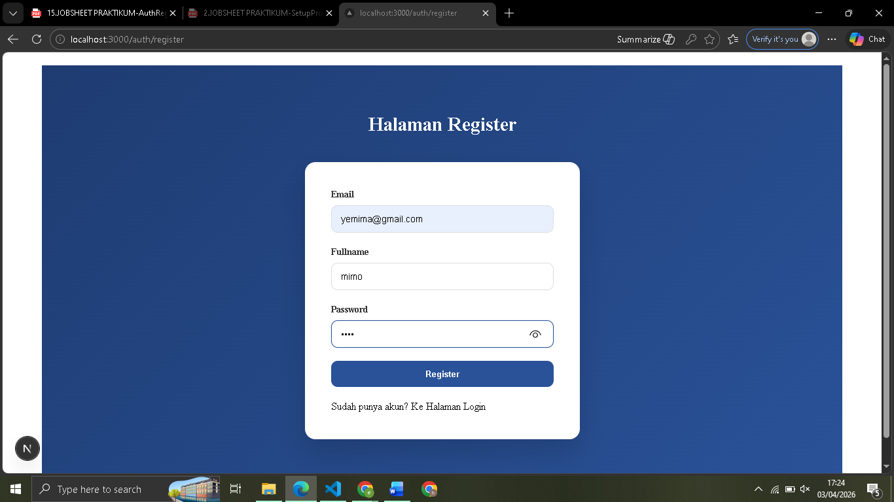
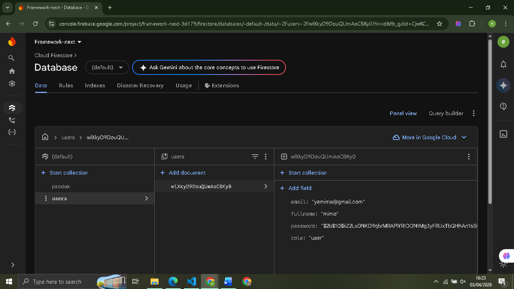
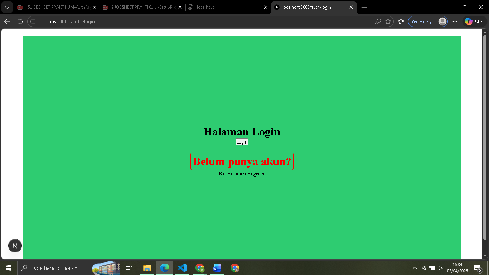
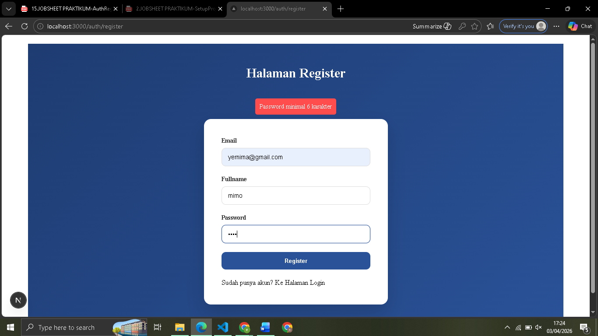

# 
 LAPORAN PRAKTIKUM PEMROGRAMAN BERBASIS FRAMEWORK 

# 
 JOBSHEET 15

    

    

     

 Nama       : ESA PRATAMA PUTRI 

 NIM        : 2341720061 

 Kelas      : TI-3D  

 Jurusan    : TEKNOLOGI INFORMASI 

## Bagian 1 – Membuat Register View

  

## Bagian 2 – Membuat API Register

  
  
  
  
  
  

## H. Pertanyaan Analisis

1. Mengapa password harus di-hash?

- Password harus di-hash untuk keamanan data. Dengan hashing, password tidak disimpan dalam bentuk teks biasa (plain text). Jika database bocor, peretas tidak bisa melihat password asli pengguna karena hashing adalah proses satu arah yang tidak bisa dikembalikan ke bentuk aslinya.

2. Apa perbedaan addDoc dan setDoc?

- addDoc: Digunakan ketika ingin Firestore membuatkan ID dokumen secara otomatis.
- setDoc: Digunakan ketika ingin menentukan sendiri ID dokumennya (misalnya menggunakan email atau UID sebagai ID). Jika dokumen sudah ada, setDoc akan menimpa (overwrite) data tersebut.

3. Mengapa perlu validasi method POST?

- Validasi if (req.method === "POST") pada API Route penting untuk mencegah penyalahgunaan endpoint. Tanpa validasi, seseorang bisa saja mencoba mengakses URL API tersebut menggunakan method GET melalui browser secara sembarangan.

4. Apa risiko jika email tidak dicek unik?

- Duplikasi data dan kerancuan akun. Jika satu email bisa terdaftar berkali-kali, sistem akan bingung saat proses Login (dokumen mana yang harus dipakai?). Selain itu, ini merusak integritas database dan bisa disalahgunakan untuk spamming.

5. Apa fungsi role pada user?

- Role berfungsi untuk manajemen hak akses (Authorization). Dengan role, kita bisa membedakan fitur yang bisa diakses oleh user biasa (misal: member) dan fitur khusus yang hanya bisa diakses oleh pengelola (misal: admin), seperti menambah produk atau menghapus data.
