# 
 LAPORAN PRAKTIKUM PEMROGRAMAN BERBASIS FRAMEWORK 

# 
 JOBSHEET 16

    

    

     

 Nama       : ESA PRATAMA PUTRI 

 NIM        : 2341720061 

 Kelas      : TI-3D  

 Jurusan    : TEKNOLOGI INFORMASI 

## BAGIAN 1 – Custom Login Page

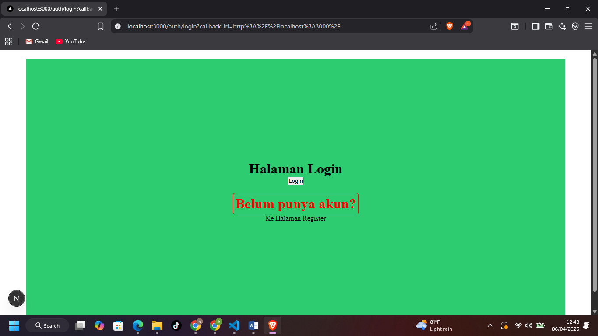  

## BAGIAN 2 – Handle Login di Frontend

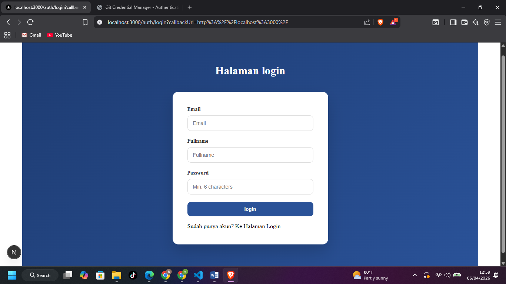  
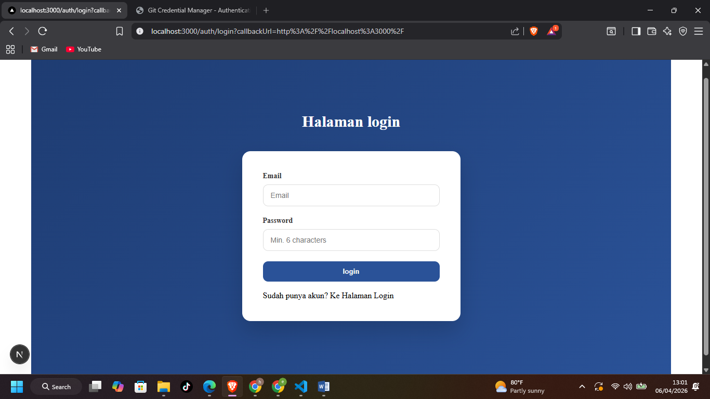  

## BAGIAN 3 – Authorize di NextAuth (Database Login)

## BAGIAN 4 – Tambahkan Role ke Token

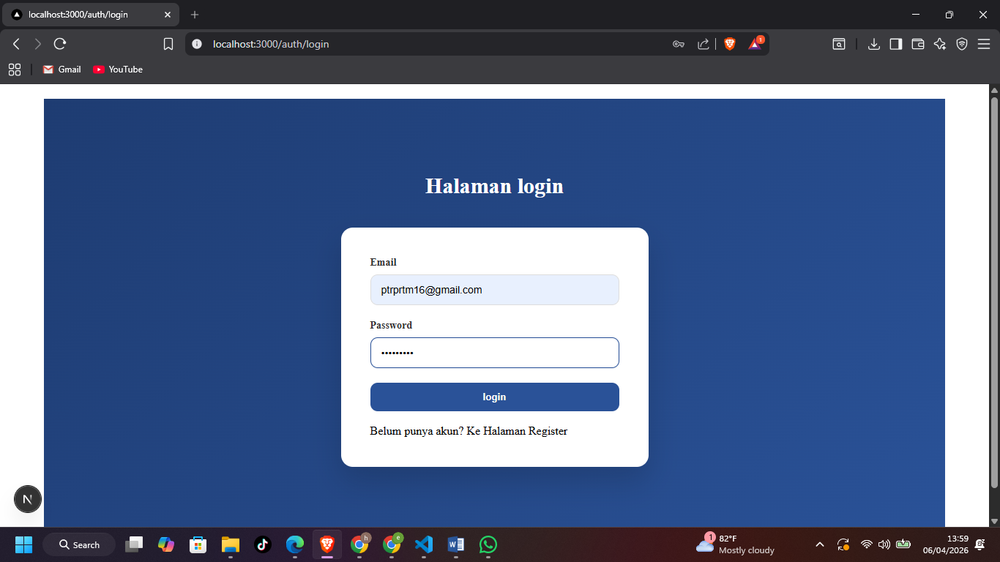  
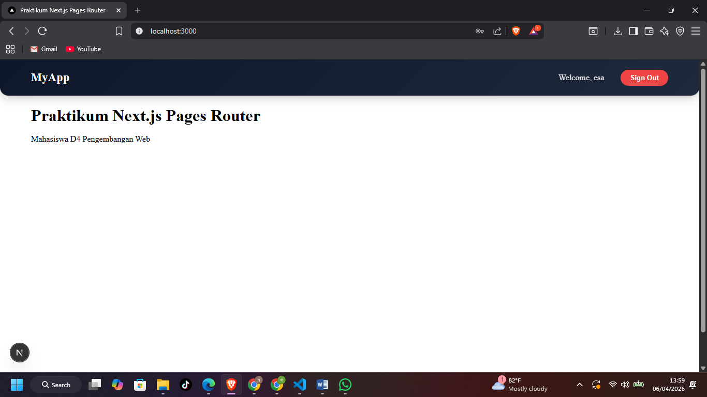  
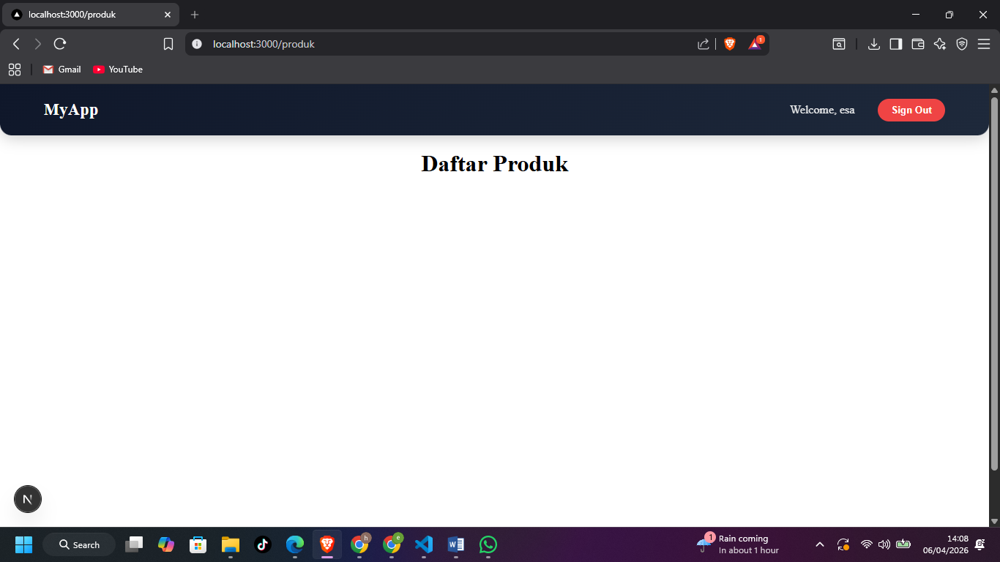  
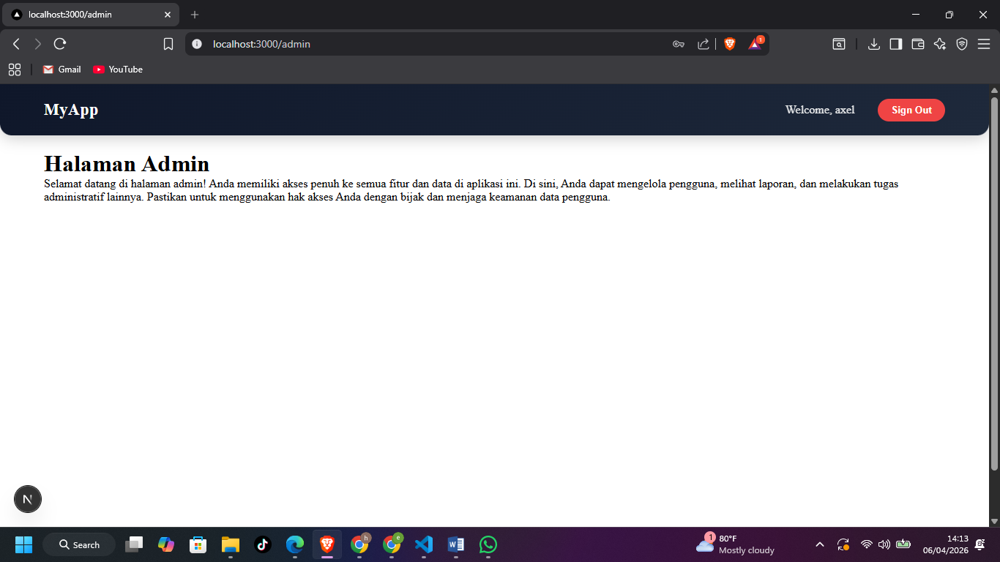  

## BAGIAN 5 – Callback URL Logic

## TUGAS 1

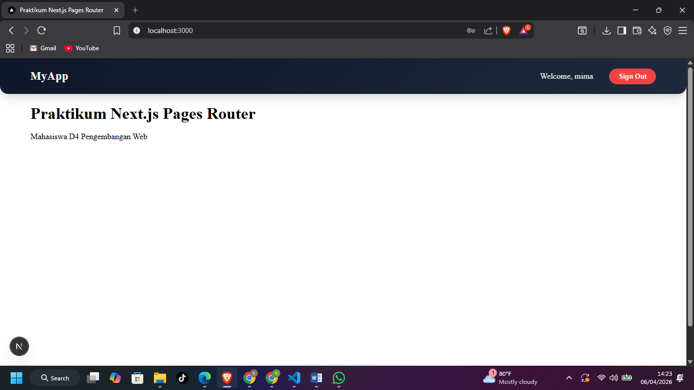  

## TUGAS 2

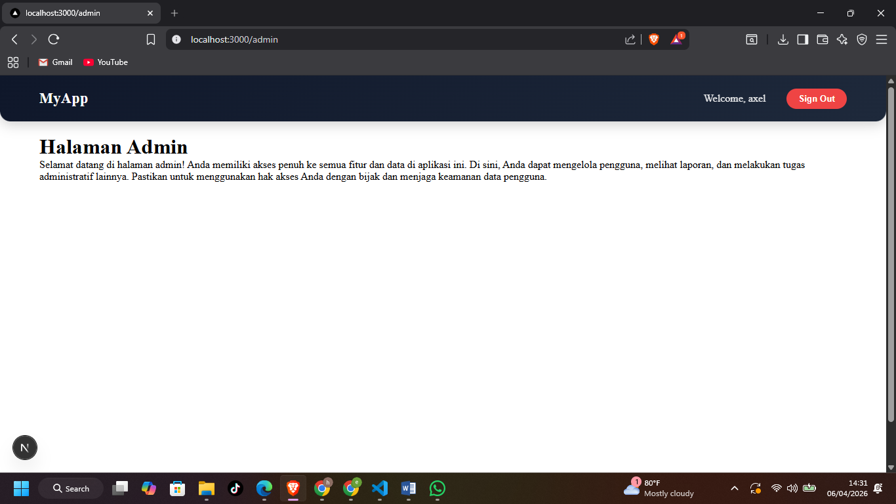  

## UJI 1

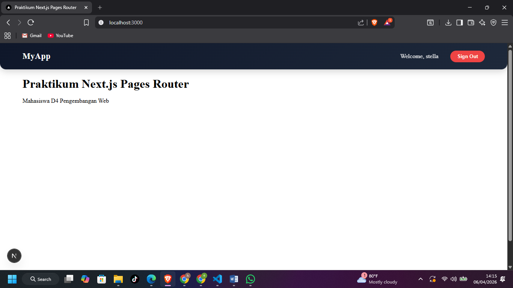  

## UJI 2

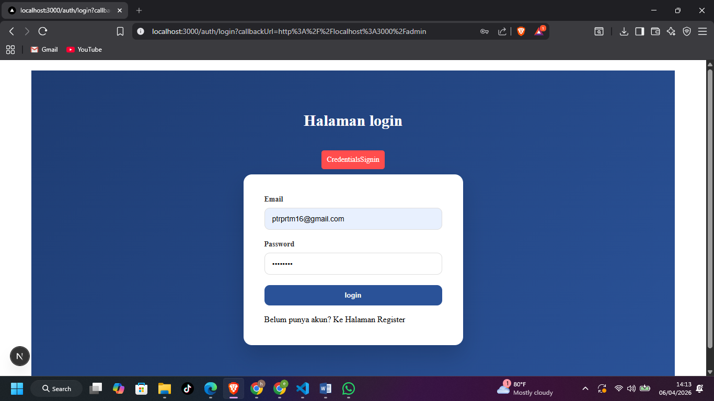  
  

## H. Pertanyaan Analisis

1. Mengapa password harus diverifikasi dengan bcrypt.compare?

- Karena password di database disimpan dalam bentuk hash (terenkripsi satu arah), bukan teks biasa. bcrypt.compare berfungsi untuk mencocokkan password yang diketik user dengan hash di database secara aman tanpa perlu membongkar (dekripsi) hash tersebut, serta tahan terhadap serangan Brute Force.

2. Mengapa role disimpan di token?

- Agar aplikasi bisa mengetahui tingkatan akses user (misal: Admin atau Member) pada setiap request tanpa harus berulang kali melakukan query ke database (Firebase), membuat aplikasi lebih cepat (efisien) dan data role tersebut aman karena token sudah terenkripsi/ditandatangani (signed).

3. Apa fungsi callbackUrl?

- Untuk meningkatkan User Experience (UX). Fungsinya adalah menyimpan alamat halaman yang terakhir kali ingin diakses user sebelum dipaksa login. Setelah login berhasil, sistem akan otomatis mengarahkan user kembali ke halaman tersebut, bukan hanya ke beranda.

4. Mengapa middleware penting untuk security?

- Middleware bertindak sebagai penjaga di gerbang utama aplikasi, memeriksa validitas token dan hak akses user sebelum halaman atau data sempat dimuat. Ini mencegah user tidak sah mengakses konten sensitif sejak dari level server-side.

5. Apa risiko jika role tidak dicek di middleware?

- Terjadi Privilege Escalation (Eskalasi Hak Akses). User biasa (Member) bisa mengakses halaman rahasia atau fitur Admin hanya dengan mengetikkan URL secara manual di browser (misal: langsung mengetik /admin). Tanpa cek role di middleware, data sensitif perusahaan/aplikasi bisa bocor ke pihak yang tidak berwenang.
