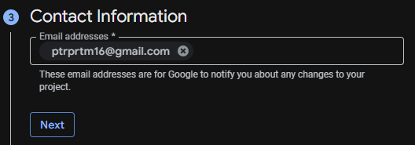
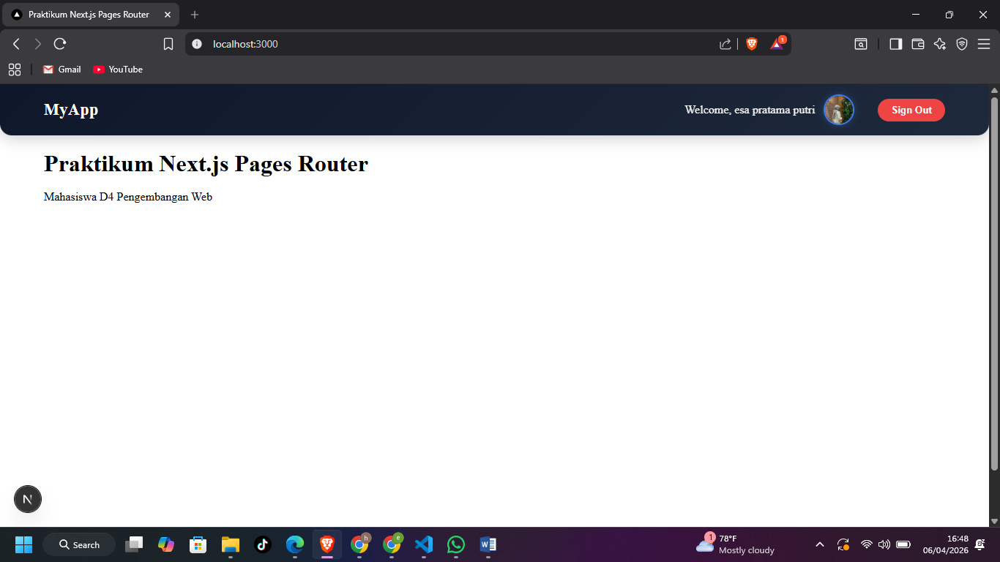
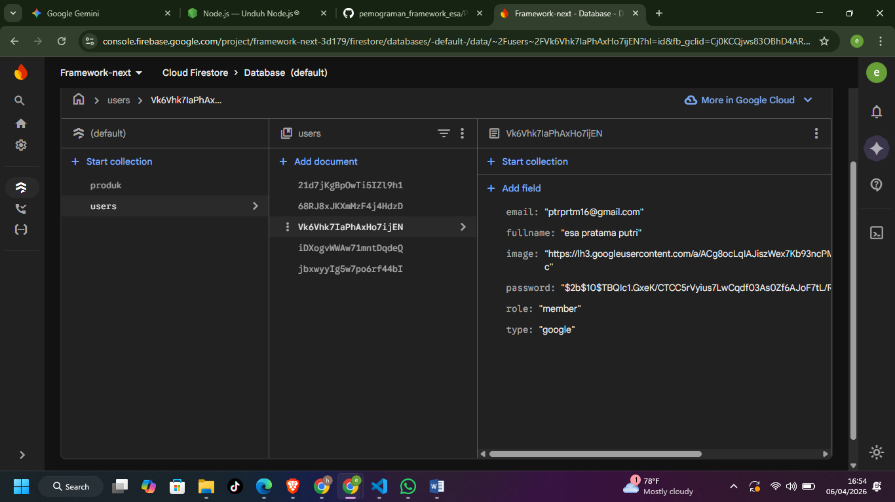
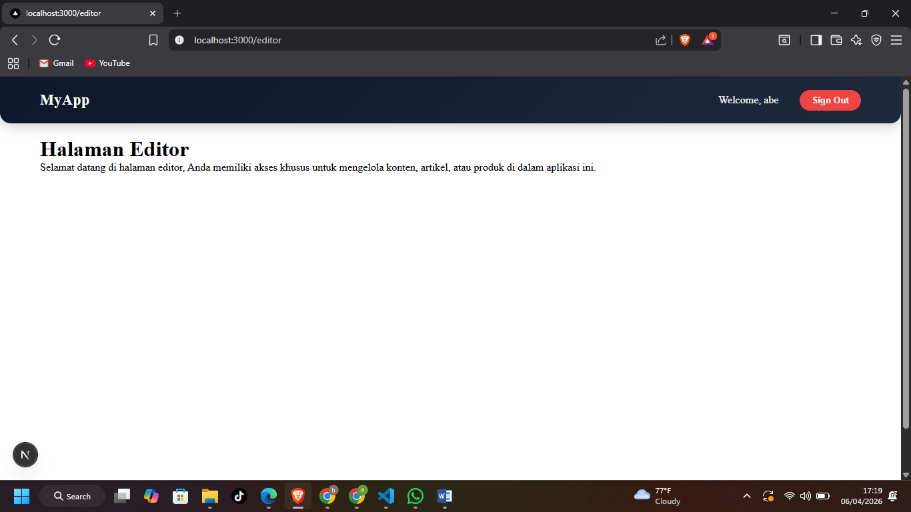
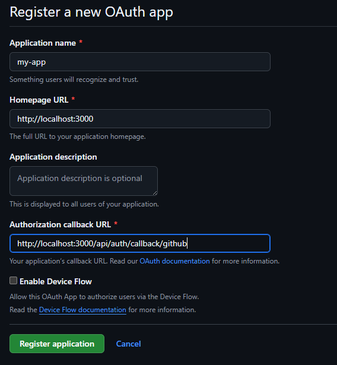
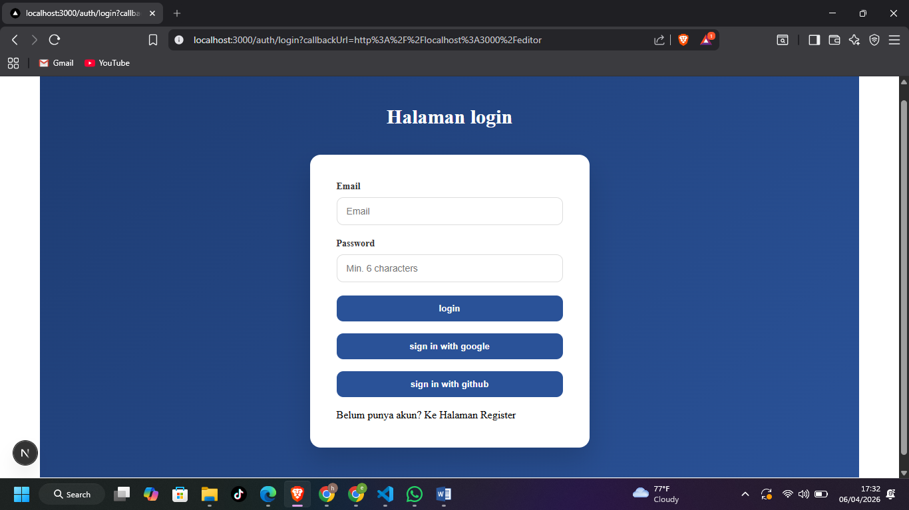
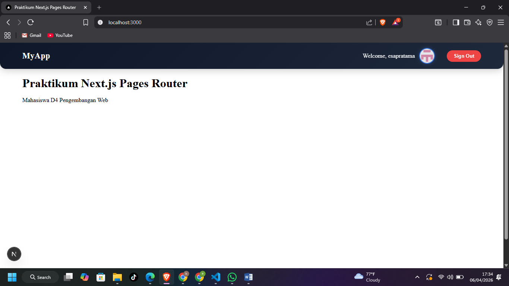

# 
 LAPORAN PRAKTIKUM PEMROGRAMAN BERBASIS FRAMEWORK 

# 
 JOBSHEET 17

    

    

     

 Nama       : ESA PRATAMA PUTRI 

 NIM        : 2341720061 

 Kelas      : TI-3D  

 Jurusan    : TEKNOLOGI INFORMASI 

## Langkah 1 – Masuk ke Google Cloud Console Buka:

  

## Langkah 2 – Buat Project Baru

  

## Langkah 3 – Konfigurasi OAuth Consent Screen

  

## Langkah 4 – Buat OAuth Credentials

  

## E. Tambahkan Button Login Google

  
  

## TUGAS 1 2

  
  

## TUGAS 3 5

  
  
  
  

## Analisis & Diskusi

1. Apa perbedaan login credential dan login Google?

- Login Credential (email & password)
  User masuk pakai akun yang dibuat di sistem kita sendiri.
  Data disimpan & dikelola oleh aplikasi (harus handle keamanan, hashing, dll).
- Login Google (OAuth)
  User masuk pakai akun Google tanpa buat password baru.
  Autentikasi ditangani oleh Google, aplikasi hanya menerima hasil login.

2. Mengapa data Google tetap perlu disimpan ke database?

- Manajemen Hak Akses: perlu menyimpan data Google (seperti email) agar bisa memberikan role khusus (admin/editor) kepada pengguna tersebut di sistem kita.
- sinkronisasi Data: memudahkan aplikasi untuk mengenali identitas pengguna secara konsisten setiap kali mereka masuk kembali.
- Relasi Data: data user bisa dihubungkan dengan fitur lain, misalnya untuk mencatat siapa yang mengedit artikel atau melakukan transaksi.

3. Apa fungsi JWT callback?

- Berfungsi untuk menyisipkan data tambahan dari database (seperti role atau fullname) ke dalam token enkripsi.

4. Mengapa perlu multi-role?

- Membatasi akses pengguna agar hanya bisa membuka fitur yang sesuai dengan fungsinya.
- Memungkinkan adanya perbedaan wewenang, misalnya Admin untuk kontrol penuh, Editor untuk mengelola konten, dan Member hanya untuk melihat konten.

5. Apa risiko jika tidak menyimpan user ke database?

- Kehilangan Kontrol: tidak bisa memberikan atau mencabut akses khusus (seperti menjadikannya Editor) karena sistem tidak memiliki catatan permanen tentang user tersebut.
- Data Terfragmentasi: setiap kali login, user akan dianggap sebagai orang asing, sehingga preferensi atau riwayat aktivitas mereka tidak bisa disimpan.
- Ketergantungan Penuh: jika mengandalkan provider (Google/GitHub) tanpa menyimpan datanya, kita akan kesulitan melakukan audit data atau migrasi sistem di masa depan.
