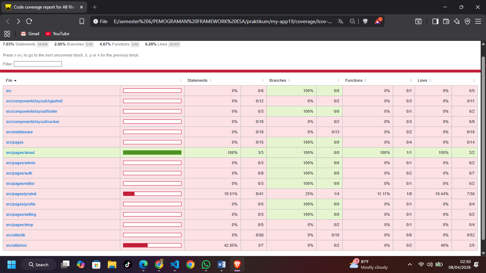
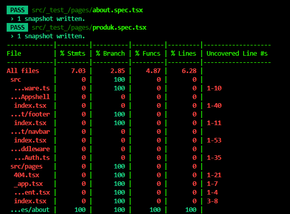
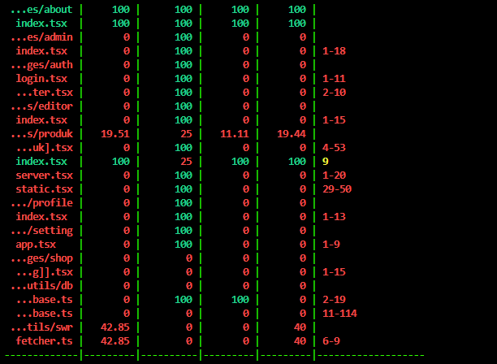
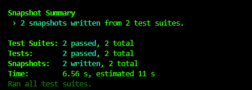

# 
 LAPORAN PRAKTIKUM PEMROGRAMAN BERBASIS FRAMEWORK 

# 
 JOBSHEET 18

    

    

     

 Nama       : ESA PRATAMA PUTRI 

 NIM        : 2341720061 

 Kelas      : TI-3D  

 Jurusan    : TEKNOLOGI INFORMASI 

## PRAKTIKUM 1 – Image Optimization

  
  
  
  

## Refleksi & Diskusi

1. Mengapa  biasa tidak optimal?

- Tag  standar hanya berfungsi untuk menampilkan gambar tanpa kecerdasan tambahan.

2. Apa perbedaan font CDN dan next/font?

- Font CDN (seperti Google Fonts Link): Browser harus mengirim permintaan tambahan ke server luar (Google) saat halaman dimuat. Ini menyebabkan keterlambatan dan risiko Flash of Unstyled Text (FOUT).
- next/font: Next.js mengunduh font saat proses build dan menyimpannya secara lokal di server aplikasi Anda. Browser tidak perlu melakukan permintaan ke luar, sehingga loading lebih cepat dan privasi lebih terjaga.

3. Mengapa script bisa membuat website lambat?

- Script (JavaScript) bersifat render-blocking. Artinya, browser akan berhenti memproses tampilan HTML/CSS sampai script tersebut selesai diunduh dan dijalankan.

4. Kapan harus menggunakan dynamic import?

- Komponen Berat: Komponen yang memiliki library besar (seperti grafik/chart atau editor teks).
- Komponen Bawah Lipatan (Below the Fold): Komponen yang tidak langsung dilihat pengguna saat halaman pertama kali dibuka, seperti Footer atau Modal.
- Interaksi Jarang: Komponen yang hanya muncul setelah klik tombol tertentu.

5. Apa dampak bundle size terhadap UX?

- Waktu Muat (FCP): Semakin besar ukuran bundle JavaScript, semakin lama waktu yang dibutuhkan browser untuk mengunduh dan memprosesnya, sehingga pengguna harus menunggu lebih lama untuk melihat konten pertama.
- Responsivitas (FID/TBT): Bundle yang besar membuat browser sibuk memproses kode, sehingga website terasa berat atau tidak responsif saat diklik oleh pengguna.
- Retensi Pengguna: Pengguna cenderung meninggalkan website yang loading-nya lebih dari 3 detik. Bundle size yang kecil menjamin pengalaman yang mulus, terutama bagi pengguna dengan koneksi internet lambat.
