# 
 LAPORAN PRAKTIKUM PEMROGRAMAN BERBASIS FRAMEWORK 

# 
 JOBSHEET 19

    

    

     

 Nama       : ESA PRATAMA PUTRI 

 NIM        : 2341720061 

 Kelas      : TI-3D  

 Jurusan    : TEKNOLOGI INFORMASI 

## PRAKTIKUM 3 – Testing Halaman About

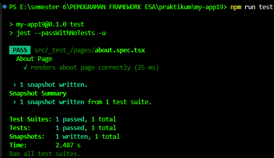  

## PRAKTIKUM 4 – Coverage Report

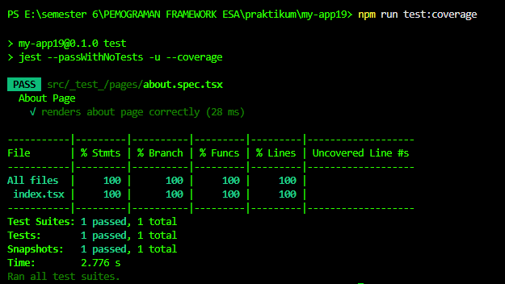  
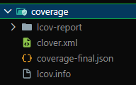  
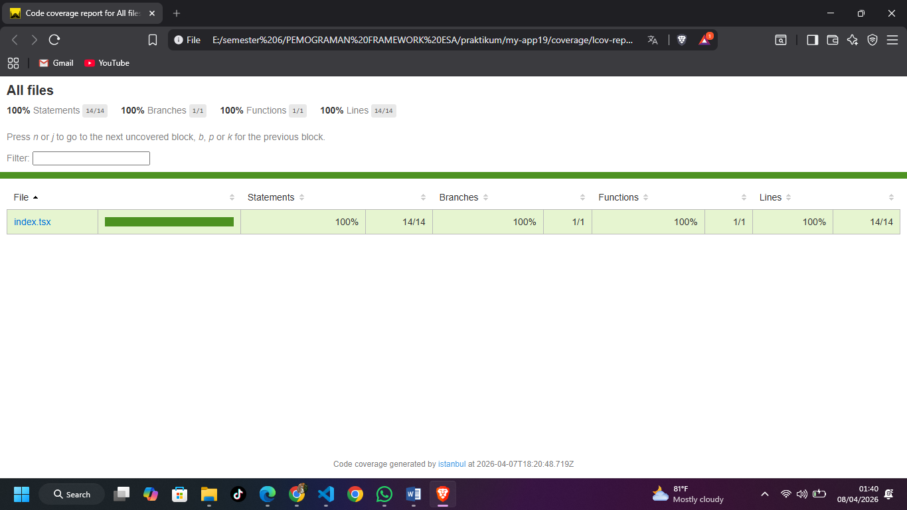  

## PRAKTIKUM 5 – Konfigurasi Coverage Lengkap

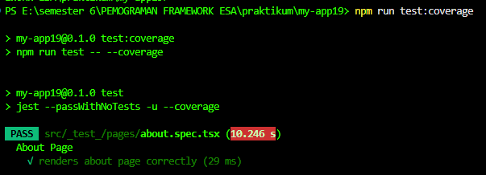  
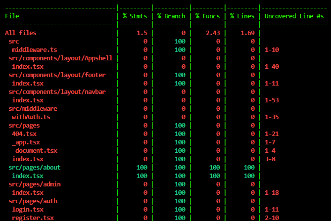  
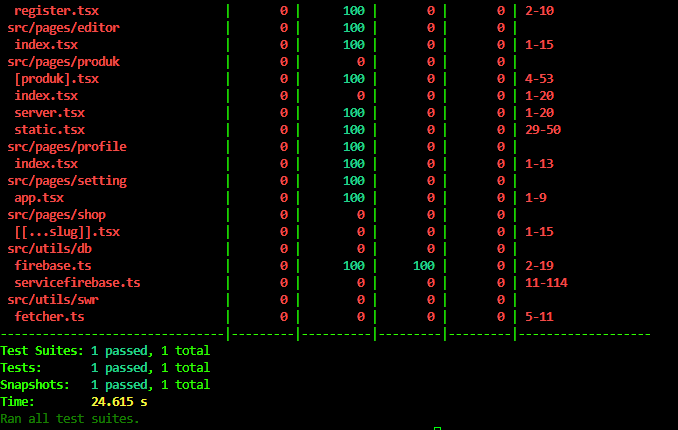  
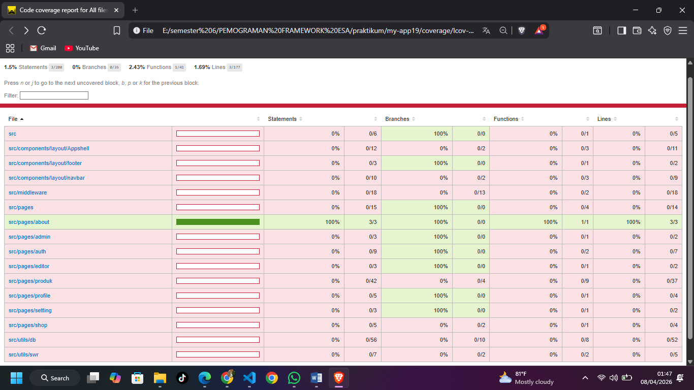  

## PRAKTIKUM 6 – Testing dengan getByTestId

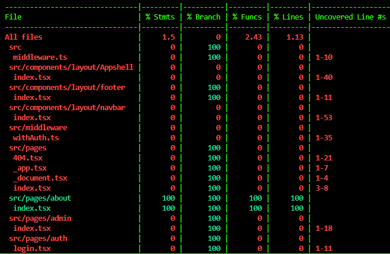  
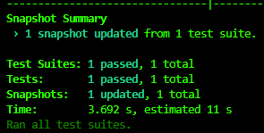  
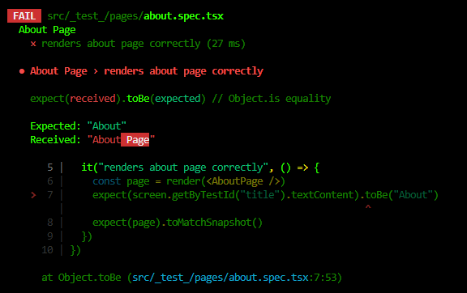  
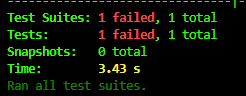  

## PRAKTIKUM 7 – Testing Page dengan Router (Mocking)

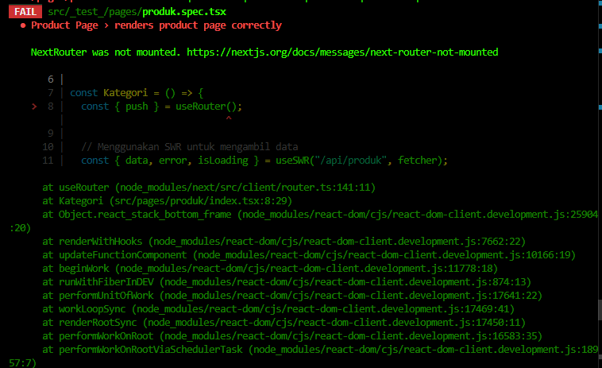  

## PRAKTIKUM 8 – Menangani Undefined Data

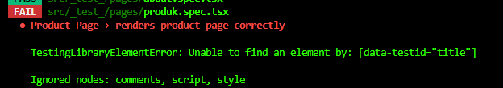  
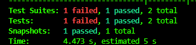  
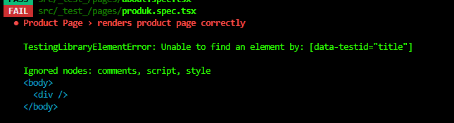  
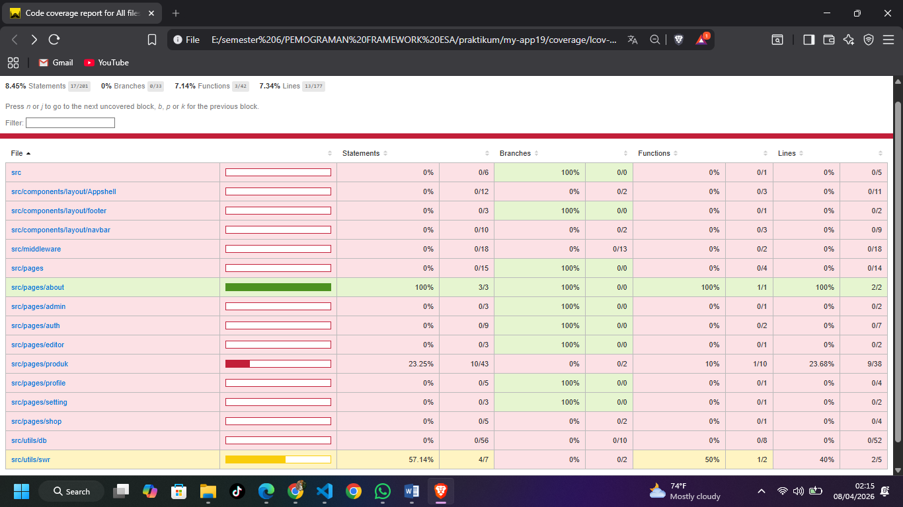  

## Tugas Praktikum

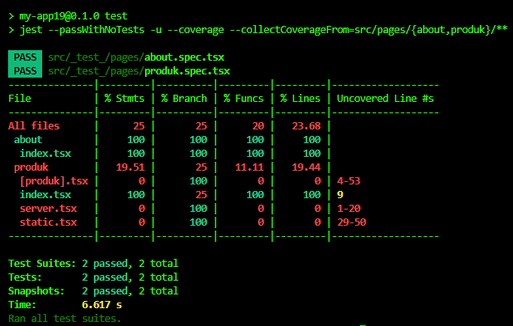  
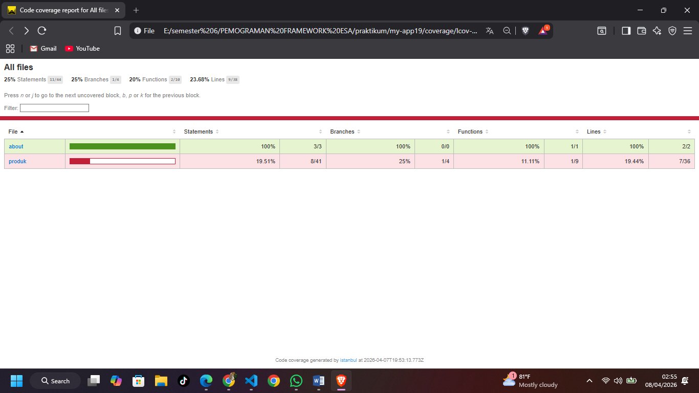  
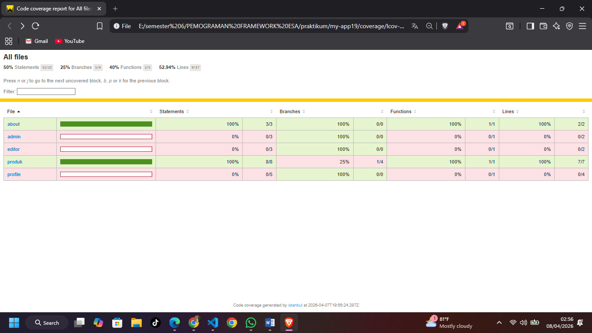  
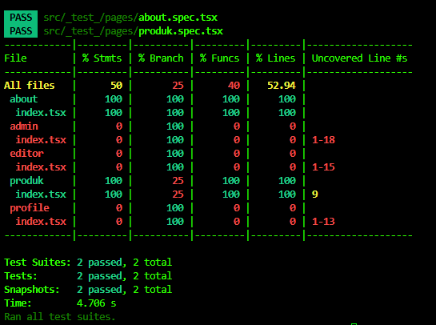  

## Diskusi & Refleksi

1. Mengapa unit testing penting sebelum production?

- Unit testing penting karena berfungsi sebagai jaring pengaman (safety net) untuk mendeteksi bug atau kesalahan logika sedini mungkin pada level terkecil (fungsi/komponen). Hal ini mencegah error fatal sampai ke tangan pengguna di tahap production dan mempermudah proses pemeliharaan kode (maintenance).

2. Mengapa branch coverage sulit mencapai 100%?

- Branch coverage sulit mencapai 100% karena kode seringkali memiliki jalur logika yang kompleks, seperti penanganan error (catch blocks), kondisi yang sangat jarang terjadi (edge cases), atau dependensi eksternal yang sulit disimulasikan secara sempurna.

3. Apa itu mocking?

- Mocking adalah teknik untuk memalsukan atau meniru objek/modul asli yang memiliki dependensi eksternal (seperti API, Database, atau Router). Tujuannya agar unit test bisa fokus menguji logika internal komponen tersebut secara terisolasi tanpa terpengaruh oleh faktor luar yang lambat atau tidak stabil.

4. Kapan snapshot test digunakan?

- Snapshot test digunakan saat ingin memastikan bahwa struktur tampilan (UI/HTML) suatu komponen tidak berubah secara tidak sengaja. Tes ini sangat berguna untuk komponen yang tampilannya sudah stabil; jika ada perubahan sedikit saja pada elemen HTML, Jest akan memberikan peringatan.

5. Apakah semua file harus dites?

- Iya, Namun secara praktis tidak selalu harus semua. Prioritas pengujian sebaiknya diberikan pada file yang mengandung logika bisnis penting dan komponen UI utama. File konfigurasi statis atau file yang hanya berisi export sederhana biasanya memiliki prioritas lebih rendah karena risiko bug-nya kecil.
