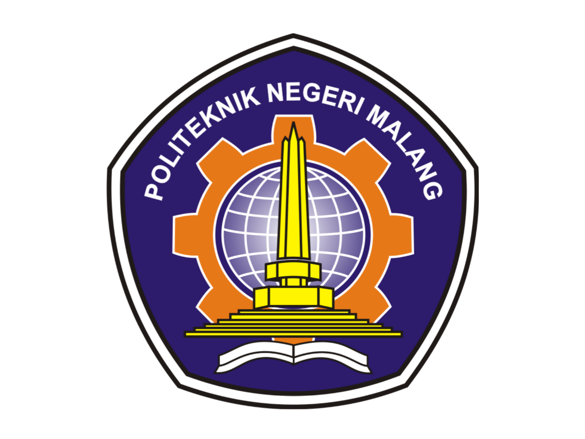

# 
 LAPORAN PRAKTIKUM PEMROGRAMAN BERBASIS FRAMEWORK 

# 
 JOBSHEET 1 

    

    

     

 Nama       : ESA PRATAMA PUTRI 

 NIM        : 2341720061 

 Kelas      : TI-3D  

 Jurusan    : TEKNOLOGI INFORMASI 

## 1. Routing Dasar (Static Routing)

## 2. Routing Menggunakan Folder

  

## 3. Nested Routing

  
  
  

## 4. Dynamic Routing

  
  
  
  

## 5. Membuat Komponen Navbar

  
  
  
  
  

## 6. Membuat Layout Global (App Shell)

  
  

## E. Tugas Praktikum

1. Tugas 1 – Routing  
     
     

2. Tugas 2 – Dynamic Routing  
     

3. Tugas 3 – Layout  
     
     
     
     

## F. Pertanyaan Refleksi

1. Apa perbedaan routing berbasis file dan routing manual?  

- Routing berbasis file otomatis dari struktur folder, routing manual harus dikonfigurasi sendiri.  

2. Mengapa dynamic routing penting dalam aplikasi web?  

- Untuk menampilkan data dinamis dengan satu template halaman.  

3. Apa keuntungan menggunakan layout global dibanding memanggil komponen satu per satu?  

- Layout global membuat aplikasi lebih konsisten, efisien, dan mudah dirawat dibanding memanggil komponen berulang.  
