# 
 LAPORAN PRAKTIKUM PEMROGRAMAN BERBASIS FRAMEWORK 

# 
 JOBSHEET 20

    

    

     

 Nama       : ESA PRATAMA PUTRI 

 NIM        : 2341720061 

 Kelas      : TI-3D  

 Jurusan    : TEKNOLOGI INFORMASI 

## deploy

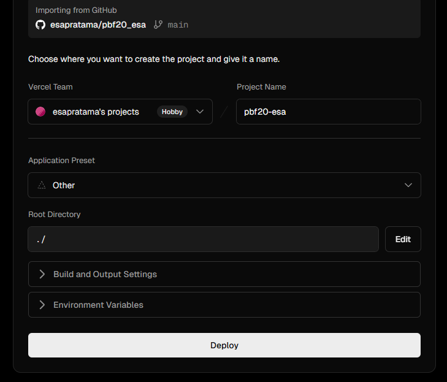  
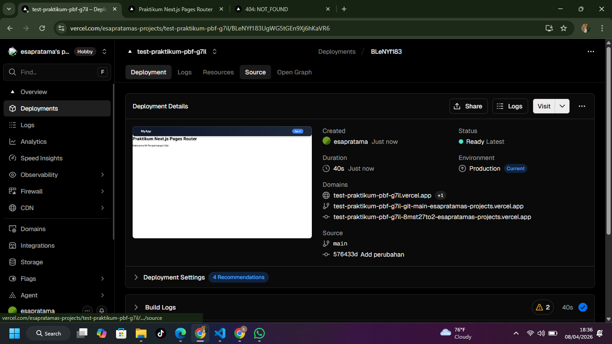  
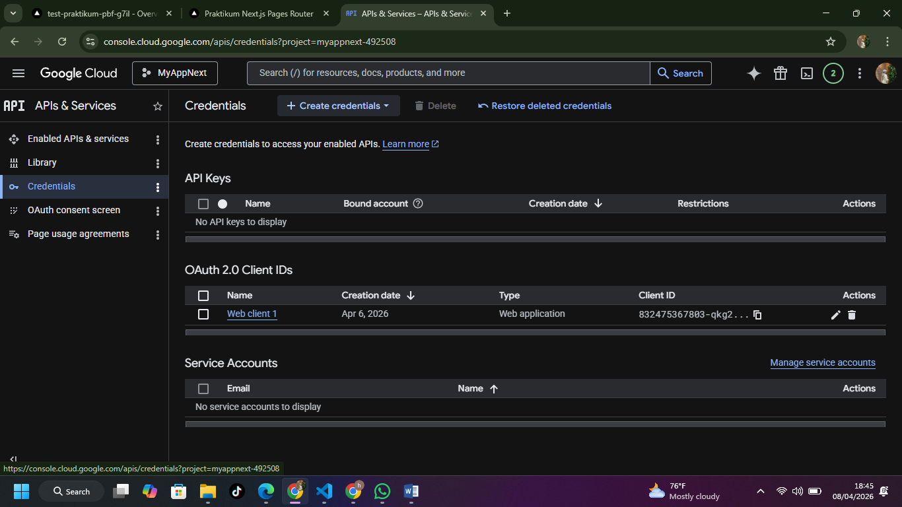  
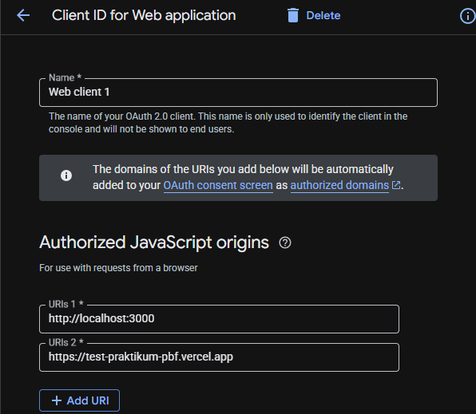  
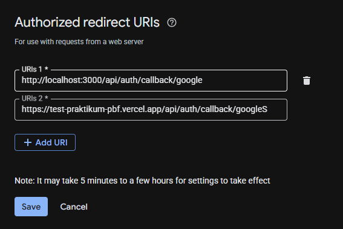  
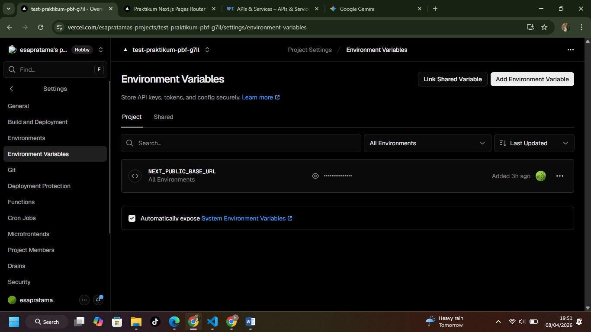  
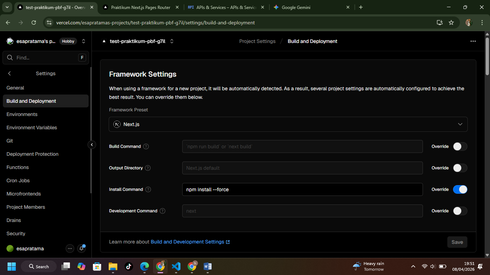  

## /about

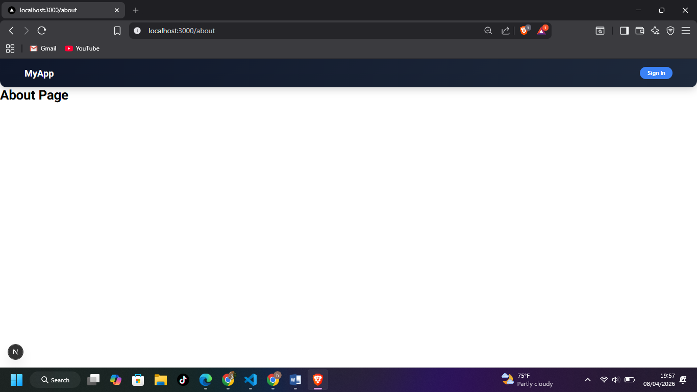  

## /product

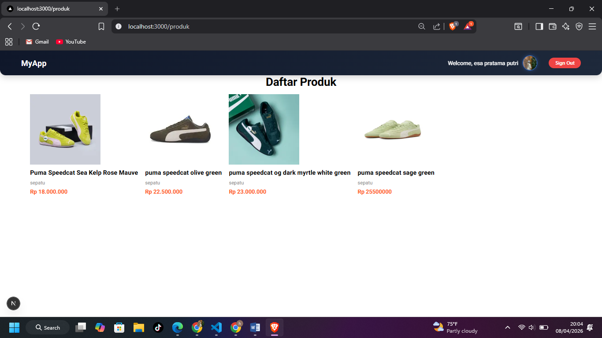  

## /profile

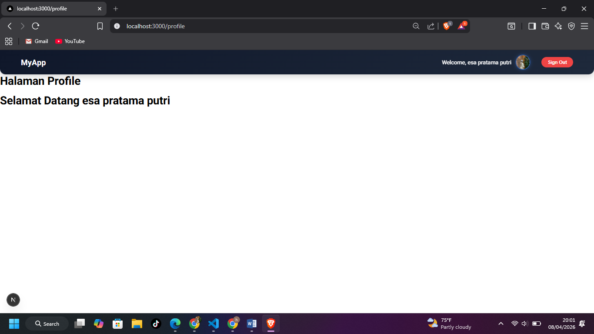  

## Login Google

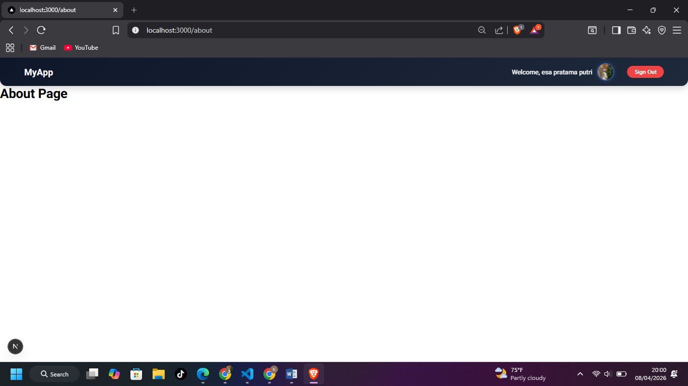  

## Login credential biasa

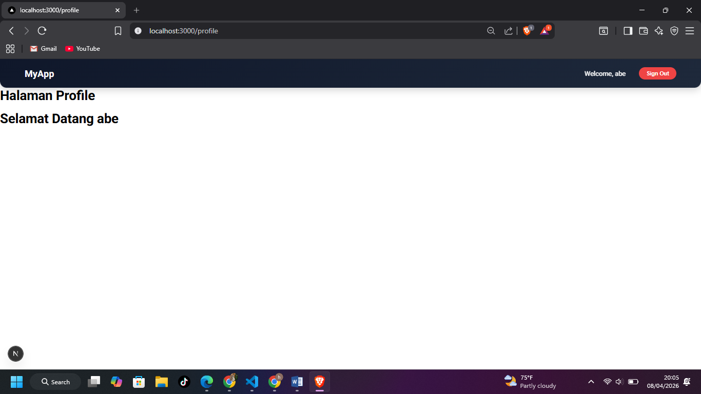  

## Refleksi & Diskusi

1. Mengapa localhost tidak boleh digunakan di production?

- Karena localhost hanya bisa diakses di komputer sendiri. Di production, aplikasi harus pakai domain publik agar bisa diakses user lain.

2. Mengapa SSG bisa gagal saat build?

- Karena proses build mengambil data saat compile. Jika API error, data kosong, atau ENV belum ada, build gagal.

3. Apa perbedaan SSR dan SSG saat deployment?

- SSR (Server-Side Rendering) : Halaman dibuat saat user request (butuh server)
- SSG (Static Site Generation) : Halaman dibuat saat build (lebih cepat, tanpa server)

4. Mengapa perlu redeploy setelah menambahkan environment?

- Karena environment variable hanya dibaca saat build, deploy. Tanpa redeploy, perubahan tidak akan diterapkan ke aplikasi.

5. Apa fungsi redirect URI pada OAuth?

- Sebagai URL tujuan setelah login dari provider (Google/GitHub). Untuk mengembalikan user ke aplikasi membawa hasil autentikasi.
