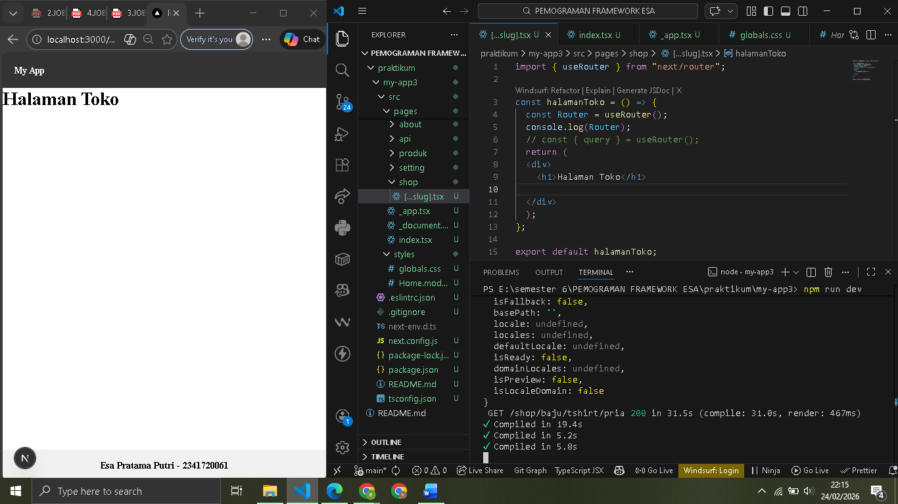
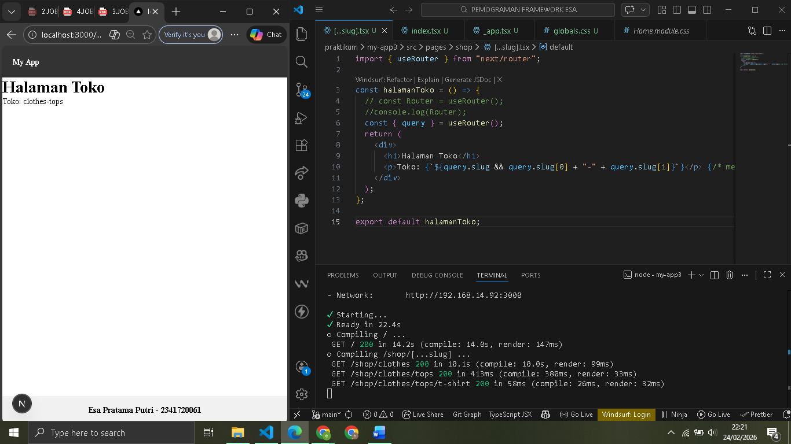
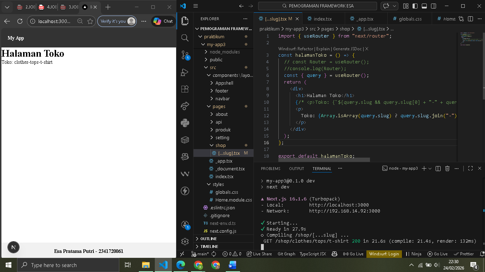
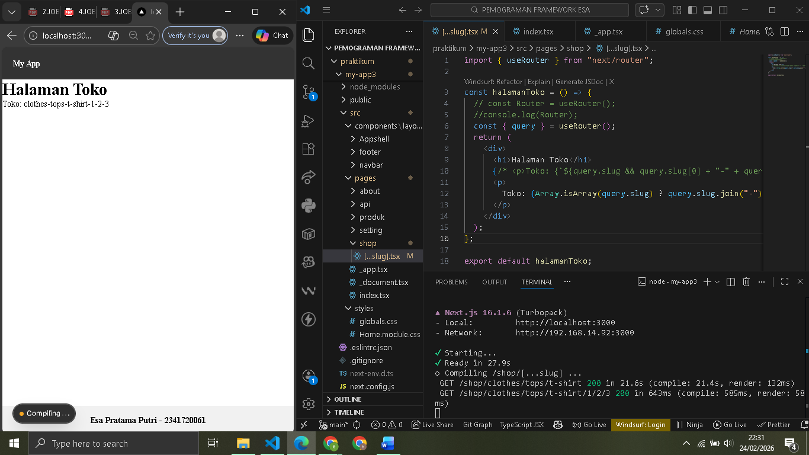
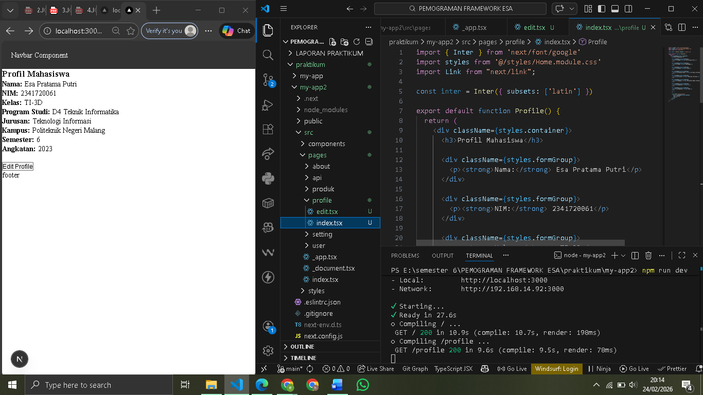
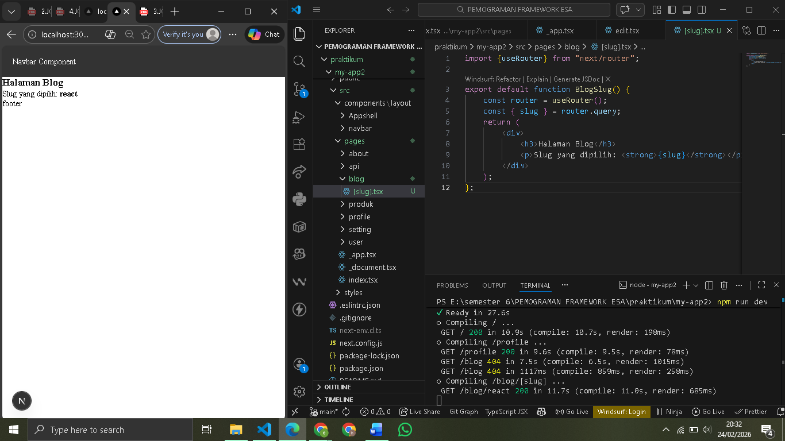
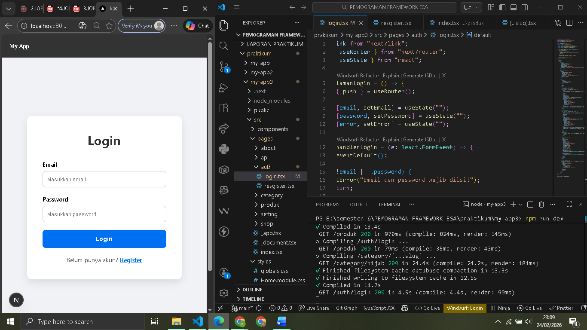
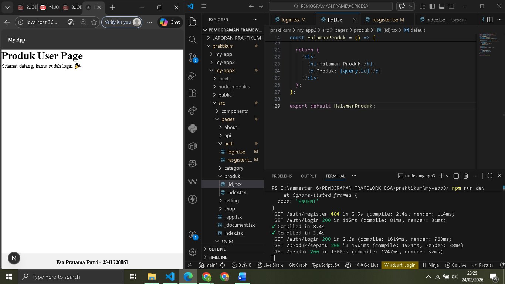

# 
 LAPORAN PRAKTIKUM PEMROGRAMAN BERBASIS FRAMEWORK 

# 
 JOBSHEET 1 

    

    

     

 Nama       : ESA PRATAMA PUTRI 

 NIM        : 2341720061 

 Kelas      : TI-3D  

 Jurusan    : TEKNOLOGI INFORMASI 

## Langkah 1 – Menjalankan Project

## Langkah 2 – Membuat Catch-All Route

  

## Langkah 3 – Pengujian Catch-All Route

  
  
  
  
  

## Langkah 4 – Optional Catch-All Route

  

## Langkah 5 – Validasi Parameter

## Langkah 6 – Membuat Halaman Login & Register

## Langkah 7 – Navigasi Imperatif (router.push)

  

## Langkah 8 – Simulasi Redirect (Belum Login)

## E. Tugas Praktikum

1. Tugas 1 (Wajib)  
     

2. Tugas 2 (Wajib)  
     

3. Tugas 3 (Pengayaan)  
     
     
     

## F. Pertanyaan Refleksi

1. Apa perbedaan [id].js dan [...slug].js?  

- [id].js digunakan untuk menangkap satu parameter dinamis, sedangkan [...slug].js digunakan untuk menangkap banyak segmen URL sekaligus dalam bentuk array. 

2. Mengapa slug berbentuk array?  

- [id].js digunakan untuk menangkap satu parameter dinamis, sedangkan [...slug].js digunakan untuk menangkap banyak segmen URL sekaligus dalam bentuk array.  

3. Kapan sebaiknya menggunakan Link dan router.push()?  

- Slug berbentuk array karena jumlah segmen URL bersifat dinamis sehingga perlu disimpan secara fleksibel.  

3. Mengapa navigasi Next.js tidak me-refresh halaman?  

- Karena menggunakan client-side navigation berbasis React sehingga hanya komponen yang berubah yang diperbarui tanpa reload penuh halaman.  
