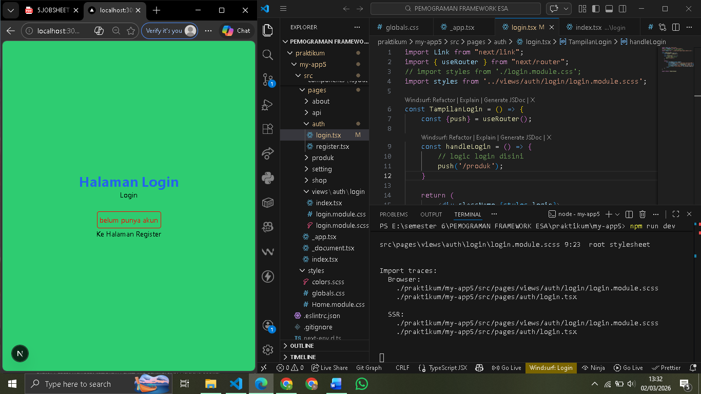
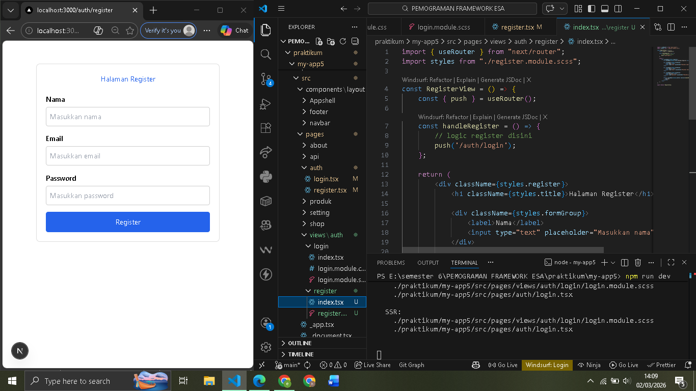
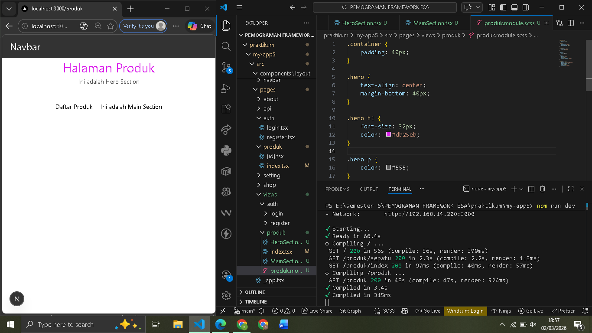
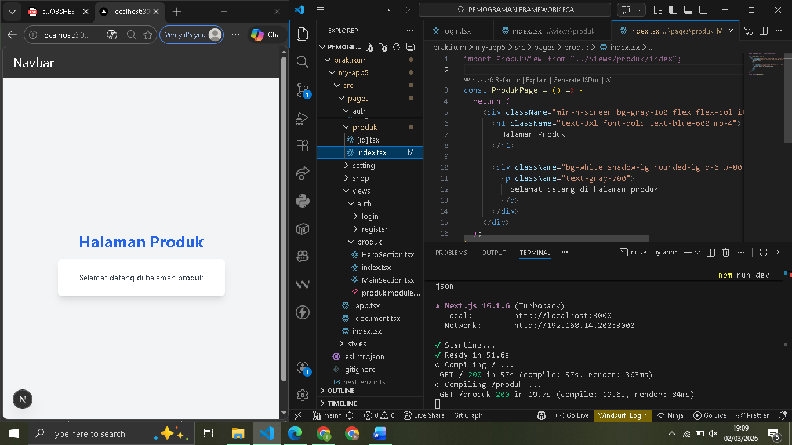

 
 LAPORAN PRAKTIKUM PEMROGRAMAN BERBASIS FRAMEWORK 

# 
 JOBSHEET 5 

    

    

     

 Nama       : ESA PRATAMA PUTRI 

 NIM        : 2341720061 

 Kelas      : TI-3D  

 Jurusan    : TEKNOLOGI INFORMASI 

## 9. Tailwind CSS

  

## E. Tugas Praktikum

  
  
  

## F. Pertanyaan Refleksi

1. Kapan sebaiknya menggunakan CSS Module dibanding Global CSS?  

- Digunakan ketika styling hanya untuk komponen tertentu dan ingin menghindari bentrok antar class.  

2. Apa kelemahan inline styling?  

- Tidak mendukung pseudo-class, media query, dan sulit dikelola pada project besar. Selain itu, kode menjadi kurang rapi karena styling bercampur dengan logika komponen.  

3. Mengapa SCSS cocok untuk project skala besar?  

- Mendukung variabel, nesting, dan mixin sehingga memudahkan pengelolaan dan konsistensi styling. Hal ini membuat kode lebih terstruktur dan mudah dirawat pada project besar.  

4. Apa keunggulan Tailwind dibanding CSS tradisional?  

- Tailwind mempercepat proses styling karena menggunakan utility class langsung di HTML. Lebih konsisten, minim konflik class, dan efisien untuk pengembangan UI modern.  
