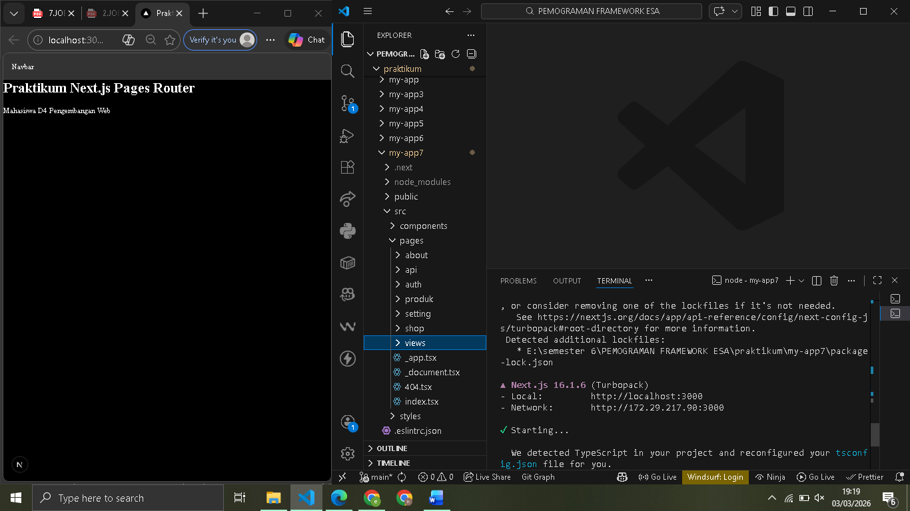
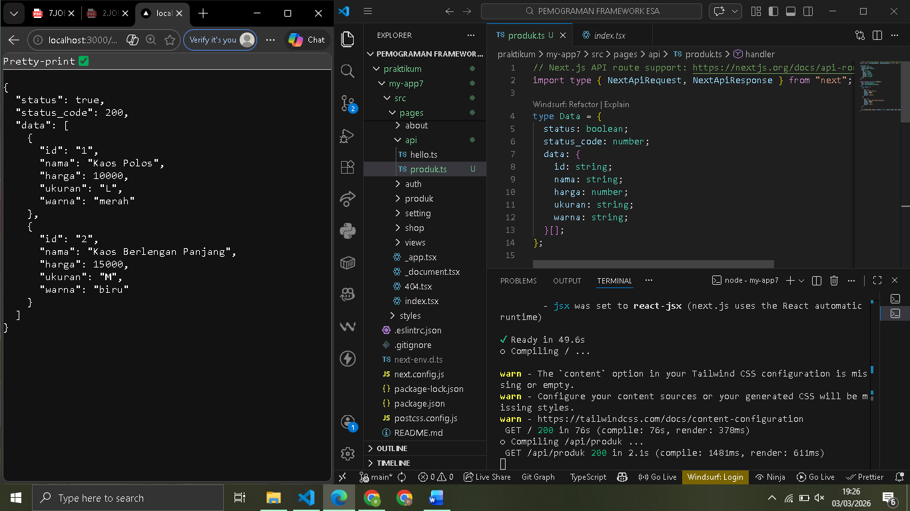
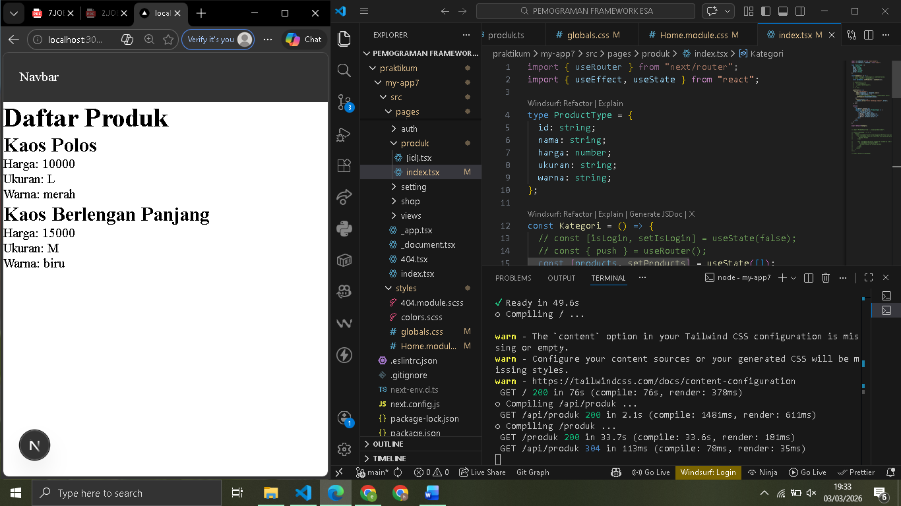
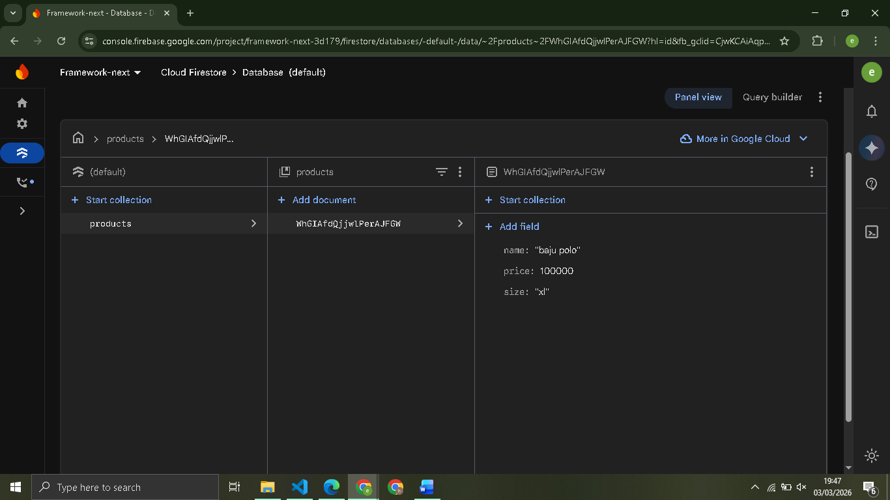
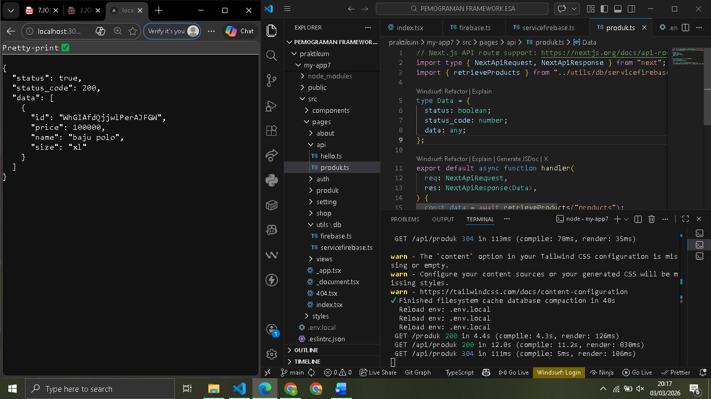
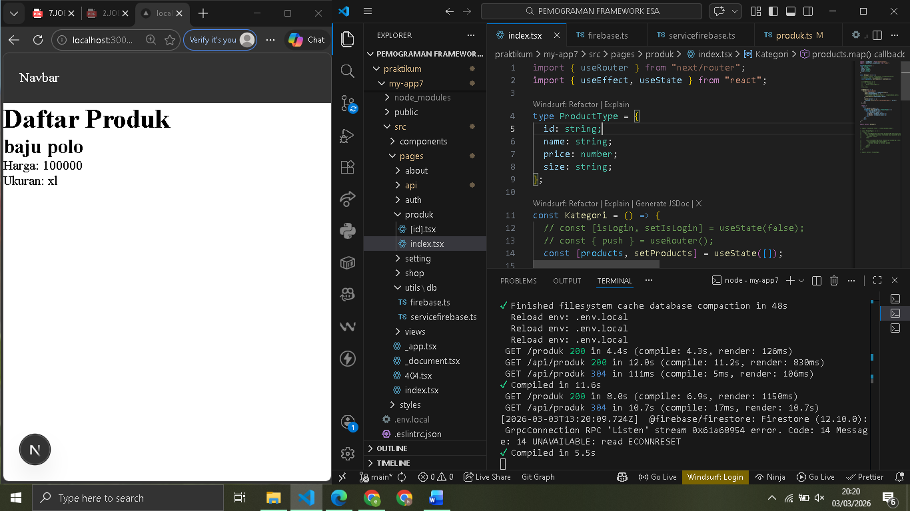
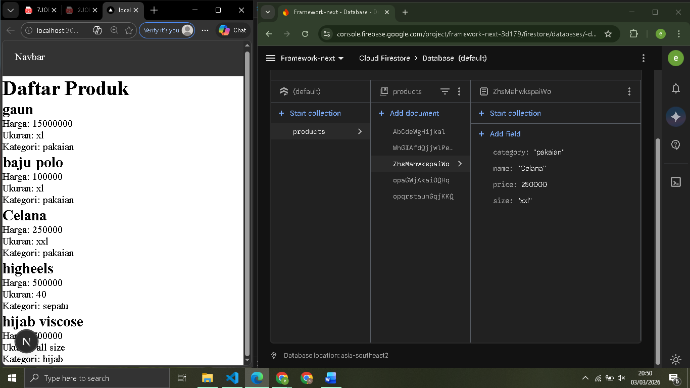
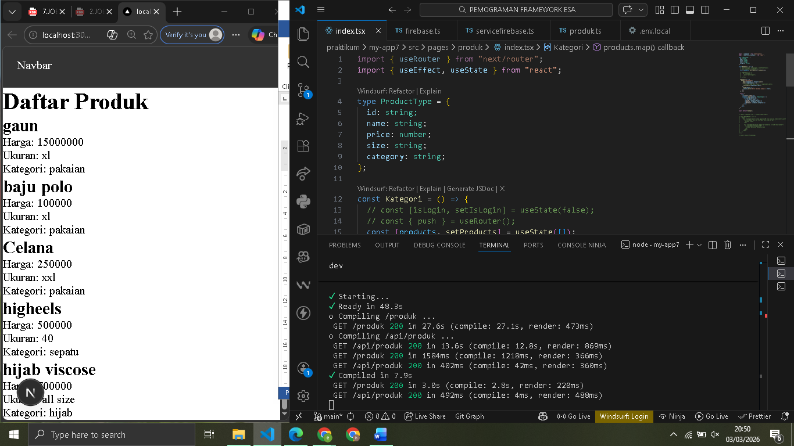
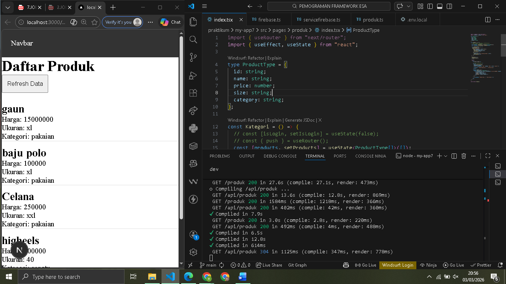

 
 LAPORAN PRAKTIKUM PEMROGRAMAN BERBASIS FRAMEWORK 

# 
 JOBSHEET 1 

    

    

     

 Nama       : ESA PRATAMA PUTRI 

 NIM        : 2341720061 

 Kelas      : TI-3D  

 Jurusan    : TEKNOLOGI INFORMASI 

## Langkah 1 – Menjalankan Project

  

## Langkah 2 – Membuat API Produk

  

## Langkah 3 – Fetch Data API di Frontend

  

## Langkah 5 – Setup Firebase

  

## Langkah 10 – API Mengambil Data Firebase

  
  

## F. Tugas Praktikum

## Tugas 1

  

## Tugas

  
  

## Tugas 3

  

## G. Pertanyaan Evaluasi

1. Apa fungsi API Routes pada Next.js?  

- Memungkinkan pengembang untuk membangun backend API langsung di dalam proyek Next.js tanpa memerlukan server terpisah.  

2. Mengapa .env.local tidak boleh di-push ke repository?  

- File .env.local tidak boleh di-push karena berisi data sensitif atau rahasia, seperti API Key, Password Database, dan kredensial Firebase.  

3. Apa perbedaan data statis dan data dinamis?  

- Data Statis: Data yang isinya tetap dan tidak berubah kecuali kode programnya diubah secara manual. Biasanya ditulis langsung di dalam komponen (hardcoded). 
- Data Dinamis: Data yang isinya dapat berubah sewaktu-waktu karena diambil dari sumber luar seperti API atau Database (seperti Firestore).  

4. Mengapa Next.js disebut framework fullstack?  

- Karena menyediakan solusi lengkap untuk pengembangan aplikasi web dalam satu tempat.
