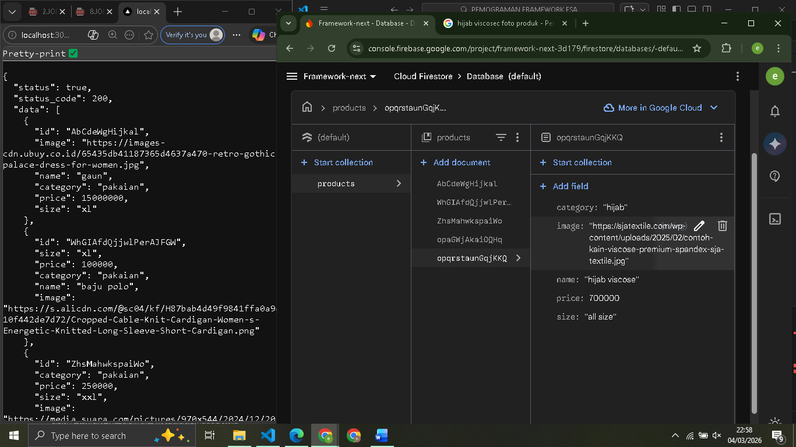
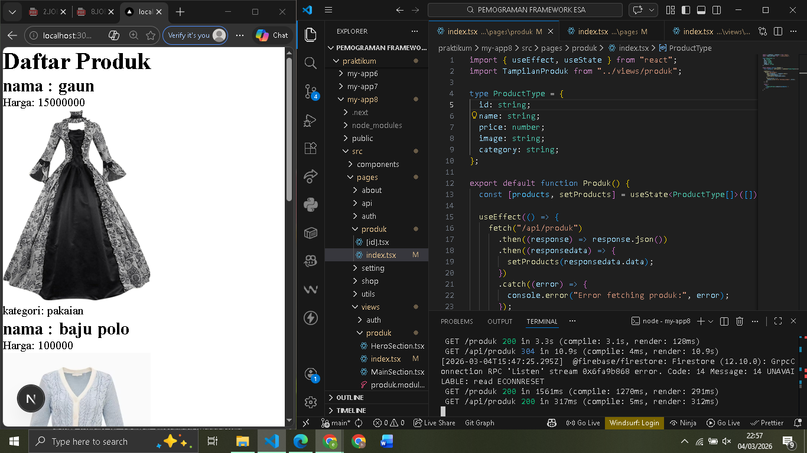
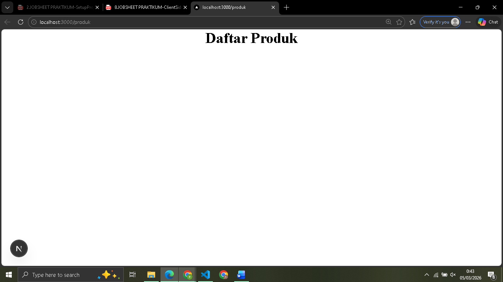

 
 LAPORAN PRAKTIKUM PEMROGRAMAN BERBASIS FRAMEWORK 

# 
 JOBSHEET 1 

    

    

     

 Nama       : ESA PRATAMA PUTRI 

 NIM        : 2341720061 

 Kelas      : TI-3D  

 Jurusan    : TEKNOLOGI INFORMASI 

## Bagian 1 – Setup Data Produk

  

## Bagian 2 – Implementasi CSR dengan useEffect

  

## Bagian 3 – Implementasi Skeleton Loading

  

## D. Tugas Praktikum

1. Jelaskan perbedaan:  
   o Client Side Rendering  

- Client Side Rendering adalah metode rendering di mana proses pembuatan tampilan halaman dilakukan di sisi client (browser).  

  o Server Side Rendering  

- metode rendering di mana halaman dirender terlebih dahulu di sisi server sebelum dikirim ke browser dalam bentuk HTML yang sudah lengkap.  

  o Static Site Generation  

- metode di mana halaman dibuat dalam bentuk HTML statis pada saat proses build (sebelum diakses pengguna).  
