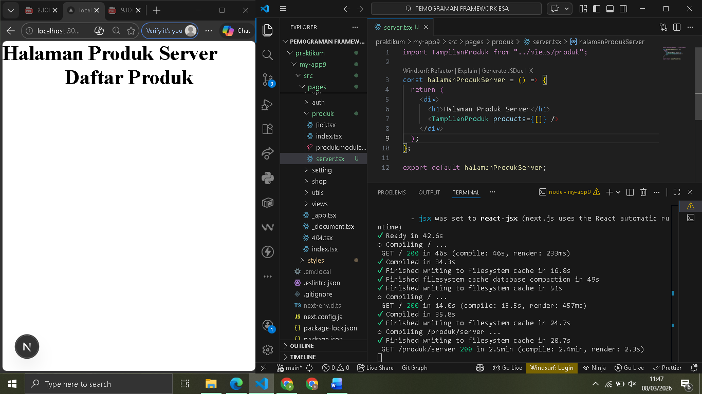
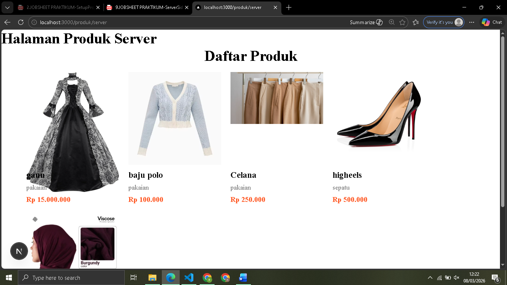
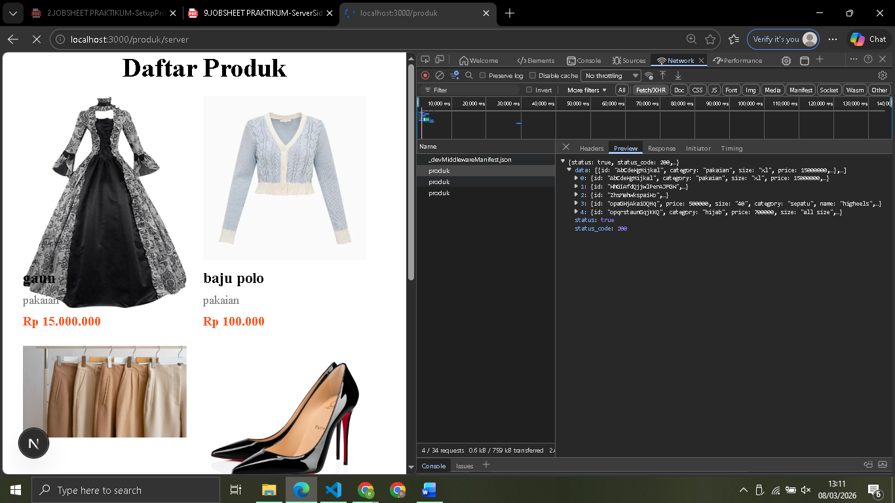
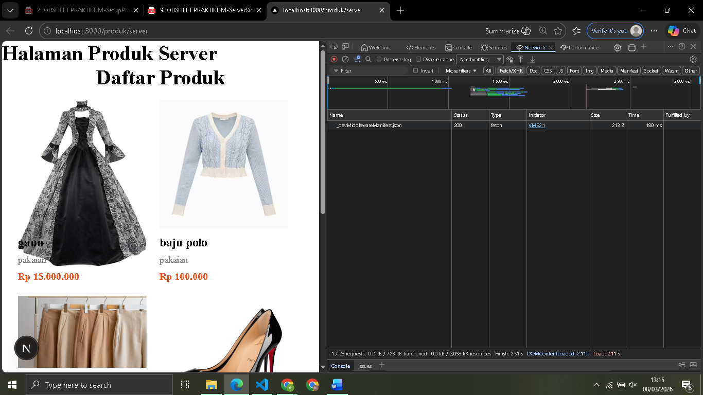
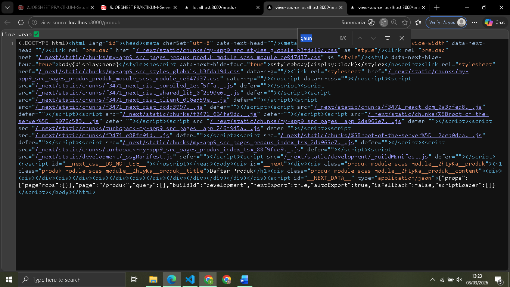
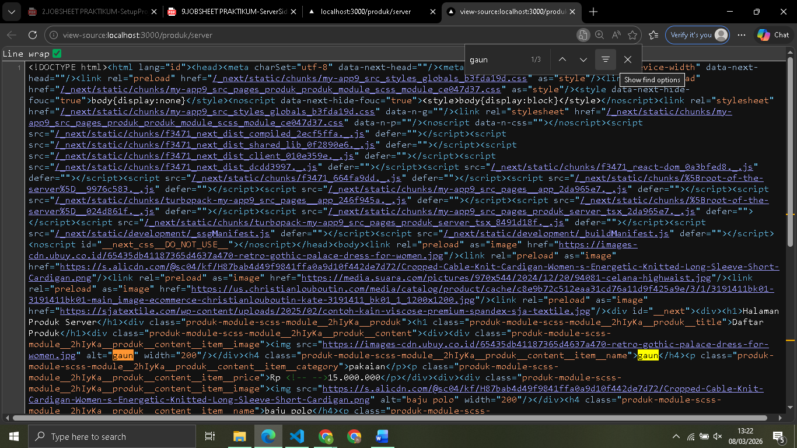
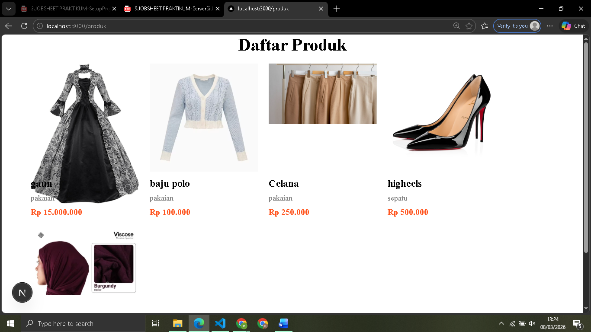

 
 LAPORAN PRAKTIKUM PEMROGRAMAN BERBASIS FRAMEWORK 

# 
 JOBSHEET 9 

    

    

     

 Nama       : ESA PRATAMA PUTRI 

 NIM        : 2341720061 

 Kelas      : TI-3D  

 Jurusan    : TEKNOLOGI INFORMASI 

## Bagian 1 – Setup Halaman SSR

  

## Bagian 2 – Implementasi getServerSideProps pada server.tsx

  

## Bagian 3 – Refactor Type ( produk type )

## Bagian 4 – Uji Perbedaan SSR vs CSR

  
  

## D. Tugas Praktikum

1. Buat 2 halaman:
   o /products (CSR)
   o /products/server (SSR)
     
     

2. Dokumentasikan:
   o Screenshot CSR
   o Screenshot SSR
   o Perbedaan Network tab
   o Perbedaan View Source
     
     
     
     

3. Buat laporan analisis minimal 2 halaman.

- Halaman CSR: Saat dilakukan view-source, konten produk (seperti teks "gaun" atau "baju polo") tidak ditemukan.
- Halaman SSR: Pada view-source, semua data produk sudah ada di dalam tag HTML (<h4>, 
).
- CSR: Adanya pemanggilan API sesaat setelah halaman dimuat. Browser sedang bekerja menarik data setelah tampilan muncul.
- SSR: Tidak ditemukan pemanggilan API produk di Network Tab sisi client. Hal ini dikarenakan proses pengambilan data sudah selesai dilakukan oleh server internal sebelum data dikirim ke pengguna.
- Loading: Pada CSR, sempat terlihat fase loading atau layar kosong sebelum data muncul. Pada SSR, konten langsung muncul secara langsung setelah halaman terbuka.

## E. Studi Analisis

1. Mengapa SSR lebih baik untuk SEO?  

- Karena server mengirimkan HTML yang sudah berisi konten lengkap. Untuk bisa langsung membaca teks dan data produk tanpa harus menjalankan JavaScript terlebih dahulu.

2. Kapan sebaiknya menggunakan SSR?  

- Saat aplikasi membutuhkan SEO yang kuat (seperti e-commerce atau portal berita).
- Halaman yang datanya sering berubah namun harus tetap terbaca.

3. Apa kekurangan SSR dibanding CSR?  

- Beban Server Lebih Tinggi: Server harus memuat HTML untuk setiap permintaan, berbeda dengan CSR yang beban renderingnya ada di browser pengguna.
- Response Time Lebih Lambat: Ada jeda waktu karena server harus menunggu data dari API selesai diambil sebelum mengirimkan HTML ke browser.
- Interaktivitas Tertunda: Pengguna bisa melihat konten, tapi tidak bisa langsung berinteraksi (seperti klik tombol) sampai proses sinkronisasi JavaScript selesai.

4. Mengapa skeleton tidak muncul pada SSR? 

- Karena data sudah diambil di sisi server melalui fungsi seperti getServerSideProps sebelum halaman dikirim ke browser. Saat HTML sampai di browser, kontennya sudah jadi, sehingga tidak ada fase "menunggu data" di sisi client yang biasanya memicu munculnya loading.
